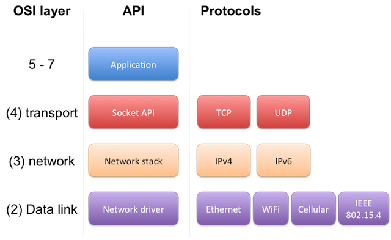
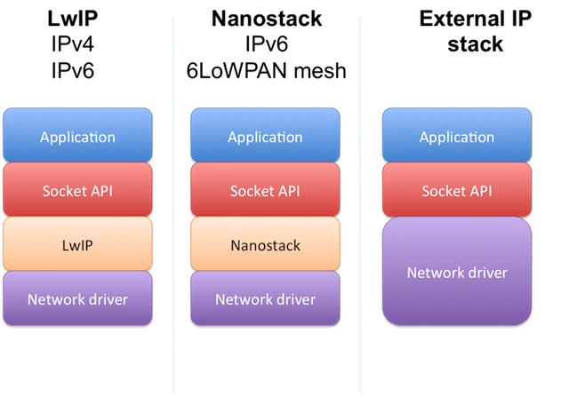
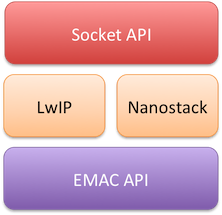
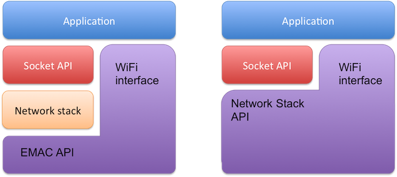
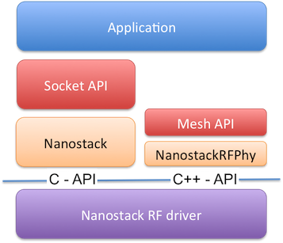

# Networking Overview

IP Networking in Mbed OS is layered in three clearly defined API levels. The diagram below shows the layers next to the closest matching [OSI model](https://en.wikipedia.org/wiki/OSI_model) layers.

The following sections introduce the APIs and technologies implemented in each level.

## Socket API

The Socket API is the common API among all IP connectivity methods. All network stacks in Mbed OS provide the same Socket API, making applications portable among different connectivity methods or even stacks.

In the OSI model, the Socket API relates to layer 4, the Transport layer. In Mbed OS, the Socket API supports both TCP and UDP protocols.

### Socket Classes

[`Socket`](https://mbed-ce.github.io/mbed-os/class_socket.html) is the abstract base class for all of the protocol-specific socket types. It defines all of the functions that comprise the Mbed OS Socket API. You cannot directly create a Socket object because it is abstract, but you can upcast any protocol-specific object to an abstract Socket object.

Sockets for different types of protocols, including UDP, TCP, and TLS, all inherit from this class.

You can use the `Socket` base class when designing portable application interfaces that do not require specific protocol to be defined. For example, instead of using `TCPSocket*` in methods, the application can use `Socket*` to allow either UDP or TCP to work, or even TLS.

## IP stacks

Mbed OS has three options to select for the IP stack. The connectivity modules provide two built-in IP stacks or an external IP stack.

As the diagram above shows, all stacks implement the same Socket API. Therefore, the application developer rarely needs to know which stack is going to be used. Mbed OS chooses one at the build time (usually LwIP in the default configuration).

Some external Wi-Fi modules and most cellular modules are in fact external IP stacks from the application point of view. In that case, the network driver implements the full network stack API. These drivers usually drive the module through an AT-command type of interface. Using an external IP module saves RAM and Flash, but depending on the driver and AT-command interface, it might not support the full features of the socket API.

The following table summarizes different stacks, use cases and their limitations.

|Stack|Network protocols supported|Use cases|Limitations|
|-----|---------------------------|---------|-----------|
|LwIP|IPv4, IPv6, PPP|Ethernet, Wi-Fi, 2G/3G/4G Cellular|<ul><li>Limited number of sockets, 3 by default</li><li>1 interface</li><li>No routing</li></ul>|
|Nanostack|IPv6, 6LoWPAN |Mesh networking, Border Router|<ul><li>Only IPv6</li><li>Less optimized for Ethernet and Wi-Fi operation (no zero-copy)</li></ul>|
|External IP module|Depends on the module|MCUs without your desired type of networking built in|Depends on the module. Usually poor match to Socket API|

### Configuring the IP stack interface

Depending on the Layer 3, Network layer, protocol used, there are different ways to configure the interface. It also depends on the stack used, which configurations are supported on each link layer.

|Stack|Data link layer|Network layer|Configurations supported|
|-----|---------------|-------------|------------------------|
|LwIP|Ethernet, WiFi|IPv4|DHCP, static|
|LwIP|Ethernet, WiFi|IPv6|[RFC 4862](https://tools.ietf.org/html/rfc4862) IPv6 Stateless Address Autoconfiguration. No DHCPv6 support|
|LwIP|PPP|IPv4,IPv6|automatic|
|Nanostack|Ethernet|IPv6|static or [RFC 4862](https://tools.ietf.org/html/rfc4862) IPv6 Stateless Address Autoconfiguration. No DHCPv6 support|
|Nanostack|IEEE 802.15.4|6LoWPAN| 6LoWPAN-ND+RPL|

## Network interfaces

Network interfaces are the application level APIs where users choose the driver, connectivity method and IP stack. Each connectivity method requires different configuration, so these APIs are not interchangeable. The application developer must choose one. Choosing the interface also automatically pulls in the network stack as a dependency.

Please note that the interface API is not the same as the network driver. The interface API is the control interface for the application. The network driver implements the controlling API only if it requires configuration from application. From the application point of view, there is no difference, but the network driver developer needs to be aware of that.

Mbed OS implements the following network interface APIs:

- Ethernet.
- Wi-Fi.
- Cellular (PPP).
- 6LoWPAN-ND mesh networking.
- Wi-SUN mesh networking.

Refer to [Networking Basics](../../how-to-use/networking-basics.md) for usage instructions.

## Network drivers

"Network driver" describes different APIs that connect a networking device to the IP stack or Socket API. Below is a description of each driver API.

### Ethernet driver

Ethernet drivers are implemented using the stack-independent EMAC API. Because the Ethernet driver interfaces only to the IP stack, it does not implement any controlling interface for the application.

Note that Mbed CE is in the process of upgrading our Ethernet drivers to use a new common base class and API. Drivers that use the new system (CompositeEMAC) provide additional configuration options, such as being able to configure the PHY chip model through a JSON option. See the [CompositeEMAC doc page](https://github.com/mbed-ce/mbed-os/blob/main/connectivity/drivers/emac/CompositeEMAC.md) for more details.

### Wi-Fi driver

There are two types of Wi-Fi drivers in Mbed OS, depending on which protocol layer the Wi-Fi device implements. Wi-Fi drivers are either a special case of Ethernet driver, or an external IP stack. Wi-Fi drivers require configuration from the application and, therefore, implement both the generic Mbed API (`EMAC` or `NetworkStack`) and the high level controlling interface API, `WiFiInterface`.

### Cellular modem driver

Cellular drivers have the same two separate cases as Wi-Fi. If they use an external IP stack, the driver implements the NetworkStack API. If they use the internal IP stack, LwIP, then they implement the Serial PPP driver.

### Mesh (Wi-SUN, 6LoWPAN-NDead) RF driver

On Mesh networks, Nanostack uses IEEE 802.15.4 radios for transmitting and receiving packets. The RF driver implements the `NanostackRfPhy` API.

This driver type has no other use cases, so it is implemented in C using a Nanostack-specific API.

Please see [Porting a new RF driver for the 6LoWPAN stack](https://os.mbed.com/docs/mbed-os/v6.16/porting/lora-port.html) for more information.
