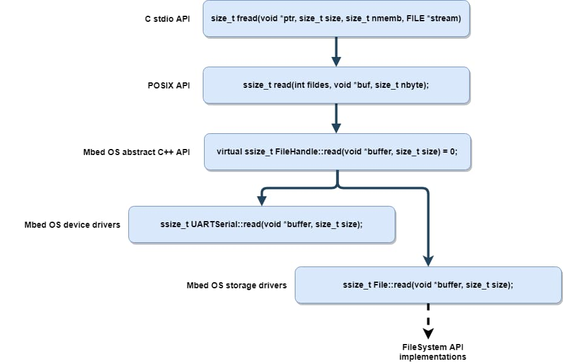

# FileHandle


[`FileHandle`](https://mbed-ce.github.io/mbed-os/classmbed_1_1_file_handle.html) is an abstract class representing an entity that supports file-like operations, such as `read` and `write`. This may be an actual `File` on a storage device provided by a `FileSystem`, or a communications device such as a serial port.

The `FileHandle` abstraction represents an already-opened file or device, so it has no `open` method of its own - the opening may take the form of a call to another class that returns a `FileHandle`, such as `FileSystem::open`, or it may be implicit in the construction of an object such as `BufferedSerial`.

!!! info
    The `FileHandle` abstraction permits stream-handling code to be device-independent, rather than tied to a specific device like a serial port. Examples of such code in Mbed OS are:

    - The console input and output streams (`stdin` and `stdout`).
    - The `ATCmdParser` helper.
    - The PPP connection to lwIP.

Exactly which operations a `FileHandle` supports depends on the underlying device, and this in turn restricts what applications it is suitable for. For example, a database application might require random-access and `seek`, but this may not be available on a limited file system, and certainly not on a stream device. Only a `File` on a full `FileSystem`, such as `FATFileSystem`, would generally implement the entire API. Specialized devices may have particular limitations or behavior, which limit their general utility. Devices that do not implement a particular call indicate it by an error return - often `ENOSYS`, but sometimes more specific errors, such as `ESPIPE` apply; please see the POSIX specifications for details.

## Relationship of FileHandle to other APIs

You can use a `FileHandle` directly, or you can use it through standard C-language APIs for file access. These APIs come in two flavors: the ones defined by POSIX, such as [`read()`](https://linux.die.net/man/2/read), which accept a file descriptor, and the ones defined by the C standard, such as [`fread()`](https://en.cppreference.com/c/io/fread), which accept a `struct FILE *` (also referred to as a "stream"). Internally, Mbed OS provides abstractions allowing a file descriptor or a `struct FILE *` to be opened for any `FileHandle` object.



*note that the above diagram refers to BufferedSerial using its old name, UARTSerial

The three APIs provide somewhat different feature sets:

API                            | C Standard              | POSIX                  | Mbed
-------------------------------|-------------------------|------------------------|-----------------------------
Headers                        | `stdio.h`, `iostream`   | `mbed_retarget.h`      | `FileHandle.h`, `mbed_poll.h`
File handle type               | `FILE *`                | `int`                  | `FileHandle` object
Blocking I/O                   | Yes (always)            | Yes (default)          | Yes (default)
Nonblocking I/O                | No                      | Yes                    | Yes
Poll                           | No                      | Yes (`struct pollfd`)  | Yes (`struct pollfh`)
Sigio                          | No                      | No                     | Yes
Disable input or output        | No                      | No                     | Yes
Device-specific extensions     | No                      | No                     | Possible using derived types
Newline conversion             | Yes (enabled with JSON) | No                     | No
Error indications              | EOF, ferror, set errno  | Return -1, set errno   | Return negative error code
Portability                    | High                    | Medium                 | Low

You can mix the APIs if you're careful, for example setting up a callback initially with `FileHandle::sigio` but performing all subsequent operations using POSIX.

!!! note "`errno` Safety"
    `errno` is not thread-local on all toolchains. This may cause problems with error handling if multiple threads are using POSIX or C file APIs simultaneously.

## Mapping between APIs

Calls are provided to map between different types of file handle:

- `int mbed_bind_to_fd(FileHandle *)`: bind a `FileHandle` to a POSIX file descriptor.
- `FILE *fdopen(FileHandle *fh, const char *mode)`: bind a `FileHandle` to a stdio `FILE`.
- [`FILE *fdopen(int fd, const char *mode)`](https://pubs.opengroup.org/onlinepubs/007904875/functions/fdopen.html): bind a POSIX file descriptor to a stdio `FILE`.
- [`int fileno(FILE *stream)`](https://pubs.opengroup.org/onlinepubs/009604599/functions/fileno.html): Obtain the file descriptor for a `FILE`
- `FileHandle *mbed_file_handle(int fd)` obtain the `FileHandle` for a POSIX file descriptor

The POSIX file descriptors for the console are available as `STDIN_FILENO`, `STDOUT_FILENO` and `STDERR_FILENO`, permitting operations such as `fsync(STDERR_FILENO)`, which would for example drain the console serial port's output buffer.

## Redirecting the console

If a target has serial support, by default a serial port is used for the console. The pins and settings for the port selection come from target header files and JSON settings. This uses either an internal `DirectSerial` if unbuffered (for backwards compatibility) or `BufferedSerial` if `platform.stdio-buffered-serial` is `true`.

The target can override this by providing `mbed::mbed_target_override_console` to specify an alternative `FileHandle`. For example, a target using SWO might have:

```cpp
namespace mbed
{
    FileHandle *mbed_target_override_console(int)
    {
        // SerialWireOutput
        static SerialWireOutput swo;
        return &swo;
    }
}
```

Then any program using `printf` on that target sends its output over the SWO, rather than serial.

!!! warning "Weak Symbol Override"
    The above code is a weak symbol override, meaning it needs to live in a .cpp file containing other code that is linked in and used in the final application, or it will not work. So don't put it in its own cpp file!

Because targets can redirect the console in this way, portable applications should not use constructs such as `Serial(CONSOLE_TX, CONSOLE_RX)`, assuming that this will access the console. Instead they should use `stdin`/`stdout`/`stderr` or `STDIN_FILENO`/`STDOUT_FILENO`/`STDERR_FILENO`.

```cpp
    // Don't do:
    Serial serial(CONSOLE_TX, CONSOLE_RX);
    serial.printf("Hello!\r\n");

    // Do do:
    printf("Hello!\n");
```

Beyond the target-specific override, an application can override the target's default behavior itself by providing `mbed::mbed_override_console`. Below are two examples that show how you can redirect the console to a debugger using semihosting or another application-specific serial port:

```cpp
namespace mbed
{
    FileHandle *mbed_override_console(int fileno)
    {
        // Semihosting allows "virtual" console access through a debugger.
        static LocalFileSystem fs("host");
        if (fileno == STDIN_FILENO) {
            static FileHandle *in_terminal;
            static int in_open_result = fs.open(&in_terminal, ":tt", O_RDONLY);
            return in_terminal;
        } else {
            static FileHandle *out_terminal;
            static int out_open_result = fs.open(&out_terminal, ":tt", O_WRONLY);
            return out_terminal;
        }
    }
}
```

The application can redirect the console to a different serial port if you need the default port for another use:

```cpp
namespace
{
    FileHandle *mbed_override_console(int)
    {
        static BufferedSerial uart(PA_0, PA_1);
        return &uart;
    }
}
```

Alternatively, an application could use the standard C `freopen` function to redirect `stdout` to a named file or device while running. However there is no `fdreopen` analog to redirect to an unnamed device by file descriptor or `FileHandle` pointer.

### Suppressing console output

To always suppress output, you can provide an `mbed_override_console` that returns a sink class that discards output. (For UART console targets, you can simply set `target.console-uart` to `false` in your `mbed_app.json`.)

To temporarily suppress output, `mbed_override_console` can return a class that acts as a switchable mux between a sink and the real output.

More portably, you could ensure all your code uses your own `FILE *output_stream` rather than `stdout`, and you could dynamically change that between `stdout` and `fdopen(Sink)`. That then doesn't rely on "under C library" retargeting of `stdout`. Instead, you must switch streams at the application level.

## Using printf and scanf with FileHandles

In older versions of Mbed that used the `Stream` class, it was possible to printf and scanf directly using the class. This is no longer possible with `FileHandle` alone, but can be done easily by using the C-level file API:

```cpp
BufferedSerial mySerialPort(...);
FILE* mySerialPortFile = fdopen(&mySerialPort, "r+"); // open in read-write mode
fprintf(mySerialPortFile, "hello\n");
```

## Polling and nonblocking

By default, `FileHandle`s conventionally block until a `read` or `write` operation completes. This is the only behavior supported by normal `File`s, and is expected by the C library's `stdio` functions.

Device-type `FileHandle`s, such as `UARTSerial`, are expected to also support nonblocking operation, which permits the `read` and `write` calls to return immediately when unable to transfer data. Please see the API reference pages of these functions for more information.

For a timed wait for data, or to monitor multiple `FileHandle`s, see [`poll()`](https://mbed-ce.github.io/mbed-os/group__platform__poll.html).

## Event-driven I/O

If using nonblocking I/O, you probably want to know when to next attempt a `read` or `write` if they indicate no data is available. `FileHandle::sigio` lets you attach a `Callback`, which is called whenever the `FileHandle` becomes readable or writable.

Important notes on sigio:

- The sigio may be issued from interrupt context. You cannot portably issue `read` or `write` calls directly from this callback, so you should queue an [`Event`](https://mbed-ce.github.io/mbed-os/classevents_1_1_event_3_01void_07_arg_ts_8_8_8_08_4.html) or wake a thread to perform the `read` or `write`.
- The sigio callback is only guaranteed when a `FileHandle` _becomes_ readable or writable. If you do not fully drain the input or fully fill the output, no sigio may be generated. This is also important on start-up - don't wait for sigio before attempting to read or write for the first time, but only use it as a "try again" signal after seeing an `EAGAIN` error.
- Spurious sigios are permitted - you can't assume data will be available after a sigio.
- Given all the above, use of sigio normally implies use of nonblocking mode or possibly `poll`.

Ordinary files do not generate sigio callbacks because they are always readable and writable.

## Suspending a device

Having a device open through a `FileHandle` may cost power, especially if open for input. For example, for `BufferedSerial` to be able to receive data, the system must not enter deep sleep, so deep sleep is prevented while the `BufferedSerial` is active.

To permit power saving, you can close or destroy the `FileHandle`, or you can indicate that you do not currently require input or output by calling `FileHandle::enable_input` or `FileHandle::enable_output`. Disabling input or output effectively suspends the device in that direction, which can permit power saving.

This is particularly useful when an application does not require console input - it can indicate this by calling `mbed_file_handle(STDIN_FILENO)->enable_input(false)` once at the start of the program. This permits deep sleep when `platform.stdio-buffered-serial` is set to true.

## Stream-derived FileHandles

`Stream` is a legacy class that provides an abstract interface for streams similar to the `FileHandle` class. The difference is that the `Stream` API is built around the `getc` and `putc` set of functions, whereas `FileHandle` is built around `read` and `write`. This makes implementations simpler but limits what is possible with the API. Because of this, implementing the `FileHandle` API directly is suggested API for new device drivers.

Note that `FileHandle` implementations derived from `Stream`, such as `Serial`, have various limitations:

- `Stream` does not support nonblocking I/O, poll or sigio.
- `Stream` does not have correct `read` semantics for a device - it always waits for the entire input buffer to fill.
- `Stream` returns 0 from `isatty`, which can slightly confuse the C library (for example defeating newline conversion and causing buffering).

As such, you can only use `Stream`-based devices for blocking I/O, such as through the C library, so we don't recommend use of `Stream` to implement a `FileHandle` for more general use.

## FileHandle using C library example

```cpp
/*
 * Copyright (c) 2006-2020 Arm Limited and affiliates.
 * SPDX-License-Identifier: Apache-2.0
 */
#include "mbed.h"

static DigitalOut led2(LED2);

// BufferedSerial derives from FileHandle
static BufferedSerial device(STDIO_UART_TX, STDIO_UART_RX);

int main()
{
    // Once set up, access through the C library
    FILE *devin = fdopen(&device, "r");

    while (1) {
        putchar(fgetc(devin));
        led2 = !led2;
    }
}
```

The example monitors a serial console device, and every time it reads a character, it sends it back to the console and toggles LED2.

## FileHandle sigio example

```cpp
/*
 * Copyright (c) 2006-2020 Arm Limited and affiliates.
 * SPDX-License-Identifier: Apache-2.0
 */
#include "mbed.h"

static DigitalOut led1(LED1);
static DigitalOut led2(LED2);

static BufferedSerial device(STDIO_UART_TX, STDIO_UART_RX);

static void callback_ex()
{
    // always read until data is exhausted - we may not get another
    // sigio otherwise
    while (1) {
        char c;
        if (device.read(&c, 1) != 1) {
            break;
        }
        putchar(c);
        putchar('\n');
        led2 = !led2;
    }
}

int main()
{
    // Ensure that device.read() returns -EAGAIN when out of data
    device.set_blocking(false);

    // sigio callback is deferred to event queue, as we cannot in general
    // perform read() calls directly from the sigio() callback.
    device.sigio(mbed_event_queue()->event(callback_ex));

    while (1) {
        led1 = !led1;
        ThisThread::sleep_for(500);
    }
}
```

The example monitors a serial console device, and every time it reads a character, it sends it back to the console and toggles LED2.