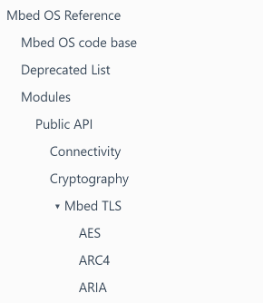

# Doxygen Documentation Tips

This page will collect some tips on how to write and structure documentation so that it fits into the Mbed CE docs.

## Running Doxygen Locally
If you have created or edited significant amounts of documentation, it's recommended to run Doxygen locally to check your docs.  After installing Doxygen (>=1.9.1), docs can be generated by opening a terminal in the `mbed-os` root folder and running:

```
$ doxygen ./doxyfile_options
```

Docs will be generated in the BUILD folder, and any errors will be printed to the screen.

## File Header

At minimum, each file should contain a block like this near the top:

```cpp
/**
 * \file
 *
 * Copyright (c) 202X SOME-NAME
 * SPDX-License-Identifier: Apache-2.0
 *
 * \brief <one-sentence description of what's in this file>
 */
```

The [\file](https://www.doxygen.nl/manual/commands.html#cmdfile) command tells Doxygen to include stuff from this file in the output docs.  The \brief command sets the description of the file.

## Groups
In order to organize the documentation into manageable chunks, Doxygen groups have been used.  These group commands create a hierarchy in the output docs:



The top-level group is mbed-os-public ("Public API"), which is defined in AnalogIn.h (for some reason).  All public code should be defined in this group or one of its subgroups.  For instance, if you wanted to add a new driver API alongside I2C and SPI, you'd add that into the `drivers-public-api` group, which would put it under "Public API" &gt; "Drivers" in the hierarchy.

### Adding Code to an Existing Group
To add entities (defines, functions, classes) in code to an existing group, they need to be surrounded by a structure like this:

```cpp
/**
 * \ingroup drivers-public-api
 * @{
 */

/**
 * \brief Description of SomeFunction
 */
void SomeFunction();

/**
 * \brief Description of MyNewDriver
 */
class MyNewDriver
{
...
};

/// @}
```

Note: You must be careful that "@}" and "@{" are correctly matched within a file, or a doxygen error will be produced.  Additionally, note that Doxygen groups **cannot span namespace boundaries**.

For example, the following is incorrect and will create a (hard to diagnose) error:

```cpp
/**
 * \ingroup drivers-public-api-gpio
 * @{
 */

namespace mbed {

class SomeClass
{
...
};

/// @}

}
```

Instead, the Doxygen commands must be inside the namespace boundaries:

```cpp

namespace mbed {

/**
 * \ingroup drivers-public-api-gpio
 * @{
 */

class SomeClass
{
...
};

/// @}

}
```

This is, similarly, not OK: 

```cpp

namespace mbed {

/**
 * \ingroup drivers-public-api-gpio
 * @{
 */

void foo();

namespace detail
{
void bar();
}

void baz();

/// @}

}
```

Tedious though it is, you must do: 

```cpp

namespace mbed {

/**
 * \ingroup drivers-public-api-gpio
 * @{
 */

void foo();

/// @}

namespace detail
{
void bar();
}

/**
 * \ingroup drivers-public-api-gpio
 * @{
 */

void baz();

/// @}

}
```

Thankfully, if your file contains only a single class, you can completely skip the @{ and @} and just add the class to the group directly:
```cpp
/**
 * \brief Description of MyNewDriver
 * \ingroup drivers-public-api
 */
class MyNewDriver
{
...
};
```

### Adding Code to a New Group
If, instead, you want to create a new group for your new driver, you'd use the defgroup command:

```cpp
/**
 * \defgroup my-driver-group My Driver Human-Readable Name
 * \ingroup drivers-public-api
 * @{
 */

class MyNewDriver
{
...
};

/// @}
```

This will create a new group in your code.  It can be referenced by \ingroup commands as `my-driver-group`, and will show as "My Driver Human-Readable Name" in the output docs.  

Note: A group name should only be defined by a \defgroup command **in one place**. 

## Rules for Extraction
There are several rules that control whether a given entity (function, constant, class, etc) in code is or is not extracted into the documentation.  Missing something?  Check that all of the following conditions are satisfied:

1. The code file containing the entity is not excluded by `EXCLUDE_PATTERNS` in doxyfile_options
1. The code file containing the entity has a Doxygen comment somewhere with an `\file` command in it.
2. The section of code containing the entity is not inside an `#ifdef` block, or, if it is, that the relevant define is included in the `PREDEFINED` block in doxyfile_options.  Currently this has to be updated manually :(
3. The specific entity is documented.  Since doxygen is configured with `EXTRACT_ALL` as false, only entities with a `/**` or `///` comment will be included in the docs.

Note: for documenting one-line things like macros and enum entries, the `///<` construct is helpful.  The following:

```cpp
#define MY_DEFINE_1 1 ///< Docs for define one
#define MY_DEFINE_2 2 ///< Docs for define two
```

is equivalent to:

```cpp
/// Docs for define one
#define MY_DEFINE_1 1 

/// Docs for define two
#define MY_DEFINE_2 2
```

## Documenting Overridden Functions
If you've used Javadoc, you might be familiar with the "@inheritDoc" directive, which is used to copy the documentation from a superclass function to a function in a subclass that overrides it.  Doxygen, in contrast, does not have this directive.  Instead, if you override a superclass function, just don't add any docs to it at all.  This will cause Doxygen to copy the docs from the superclass. 