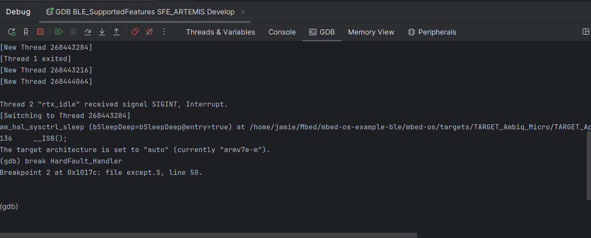

# CLion Setup

This page will show you how to take an existing Mbed CE project and use it with the CLion IDE.

Note: CLion is a paid product for commercial use, costing about $100 yearly (there's a subscription, but if you cancel it you can keep using your current version forever). However, it is free for non-commercial use. There is also a free 30-day trial available for everyone. 

I (Jamie) can say that CLion is the best C++ IDE I've personally used, and I highly recommend giving it a shot. The three main advantages of CLion over VS Code are:

- Much faster searching for usages and references, as CLion indexes everything in advance
- More intelligent source code analysis - CLion is more confident in determining whether source code is correct and gives you more options for refactoring and analyzing it
- Ability to have multiple build configurations active at one time, whereas VS Code requires manually switching between them

## Installing CLion
1. Download JetBrains Toolbox from the [download page](https://www.jetbrains.com/toolbox-app/).
2. On Windows/Mac, run the installer and go through the install.  You can then run CLion from your OS menu.  On Linux, you'll get a tar file instead.  Extract the tar file to Downloads, and move the folder to /opt/.  Then, you will be able to run the toolbox by executing `/opt/jetbrains-toolbox-x.y.z/bin/jetbrains-toolbox` in a terminal.
3. In Toolbox, log in to your JetBrains account and run CLion
3. The first time you open CLion you will get a license screen if you don't already have a license configured. You must now select non-commercial use, start a trial, or purchase a license.
4.  You should now be at the IDE start screen!  
    

## Importing the Project
1. Now, in CLion, click on Open, then browse to the root folder of your project.  Then, click OK.
    {: style="width: 50%"}
2. You'll likely get the below trust dialog box.  Click on Trust Project.  
    
3. If this is your first project, CLion will ask about setting up a toolchain.  You can accept the defaults here and click Next, because the Mbed build system overrides the compiler selection.
    
4. Now, you will get a wizard to create a build profile.  For now, change the "Build Type" to "Develop", and set the Name to include the your target name and "Develop".  Also, in the "CMake Options" field, set MBED_TARGET to match your board name (e.g. `-DMBED_TARGET=SFE_ARTEMIS` for the Artemis board). Also, optionally you can specify the [upload method](../../upload-methods.md) to use.  Or, leave this unset to use the Mbed OS defaults for your board.  
    
    - If you need Debug or Release configurations instead of Develop, you can come back here later and create them following the same process.
    - If your upload method supports debug, you will need to add an additional parameter called `MBED_CLION_PROFILE_NAME` with the name of the profile. For the example above, I'd add `-DMBED_CLION_PROFILE_NAME="Develop SFE_ARTEMIS"`.

    Finally, hit Finish.

5.  If all goes well, you should see the CMake project successfully configure and load.  If not, you may need to double-check the [toolchain setup guide](https://github.com/mbed-ce/mbed-os/wiki/Toolchain-Setup-Guide) to make sure everything is set up OK.

NOTE: When working with Mbed projects, the Tools &gt; CMake &gt; Reset Cache and Reload option is your friend if things break.  If your project did not find the compilers successfully, things moved on the disk, or you're getting other errors, make it your first recourse to try this option.

{: style="width: 50%"}

## Flashing Code

To flash code, find the entry labeled `flash-<your target>` in the menu at the top.  Then, click the hammer button (NOT the play button).

Note: Mbed OS tends to clutter this menu up with its own targets.  To find your target quickly, you can just start typing with the menu open, and it will search the list.  Maybe this is obvious to you but it took me like 4 years to figure it out...

## Debugging
1. First, if you haven't already, you will need to make sure the project is configured to use an upload method that supports debugging. Read about upload methods on the [Upload Methods page](../../upload-methods.md), and select a method to use using the -DUPLOAD_METHOD=<method> flag to CMake.  Note: you can edit the CMake flags that you initially configured by going to Settings > Build, Execution, Deployment > CMake.
    - You may also need to add the `MBED_CLION_PROFILE_NAME` flag as described earlier.
2. In CLion, find the GDB debug configuration for your executable in the targets menu.  This will be near the bottom and start with "GDB", then your target name.  Make sure to select the one that matches your build type too -- if you are working in the Develop configuration, don't pick the Debug one!
    
3. With the configuration selected, click the green bug button at the top.  If source files have been modified, the code will be rebuilt and downloaded to the target.  Then, GDB will start.
    - Note: If you wish to have the code stop at main(), you must set a breakpoint there before starting the debug session. You may also need to issue a reset after the debug session starts (via the R-with-a-bar-over-it button).
    - Note: With CLion, the GDB command line console is available by going to the GDB tab in the Debug panel.  You can use this console in parallel with the GUI to evaluate expressions and set breakpoints.
        

### Tips
- **Increasing GDB Timeout:** Sometimes, on Mbed, when you have deeply nested stack frames and lots of local variables, GDB can take a very long time to load after you hit a breakpoint, on the order of a minute.  This can cause CLion to time out and terminate the debugger session.  You can change the timeout by following [these instructions](https://www.jetbrains.com/help/clion/configuring-debugger-options.html#gdb-startup).  I'd recommend at least 120000 ms.
- **Moving the navigation bar to the top:** In the old CLion UI (and VS Code too) the navigation bar which tells you what file you're in is at the top of the screen, but in the new UI it's at the bottom for some ungodly reason (where you will never see it). You can move it back to the top via a well-buried menu option: View &gt; Appearance &gt; Navigation Bar &gt; Top
    - 