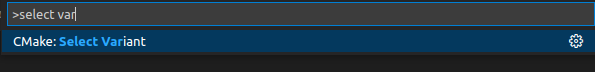

# VS Code Setup

This page will show you how to set up VS Code, and also how to load an existing Mbed-CE project and develop it using the VS Code IDE.

> Note that VS Code can develop locally, over an SSH connection to a remote host, or over a connection to Windows Subsystem for Linux.

## Setting Up VS Code

You can watch this part in video version - [Youtube guide](https://youtu.be/g2nUJJtCmDA)

1. If you don't have VS Code, you'll need to install it per the instructions [here](https://code.visualstudio.com/download).  Open it, and go through the getting started wizard according to your preferences.
2. If connecting to a remote workspace, connect to it now and open the folder with your project.
3. Go to the Extensions menu on the left, then search for and install the following extensions.  If connected to a remote workspace, make sure to install the extensions for the remote host as well.
    - C/C++
    - Better C++ Syntax (recommended addon for C/C++)
    - CMake Tools (allows building CMake projects)
    - Cortex-Debug (allows VS Code to connect to an embedded GDB server).  
       - NOTE: If you have GDB 8 instead of a newer version (common in older GNU ARM toolchains) you will need to install version 1.4.4 of this extension, future versions dropped support for it.  

## Loading your Project
You can watch this part in video version - [Youtube guide](https://youtu.be/9ZDH5YIk_8g)

1. Before you open your project in VS Code, create two more files in your project folder:
   1. If the project is new or does not already contain folder `.vscode` with a file `settings.json` inside (`.vscode/settings.json`),you will need to create them both and place the content below into `settings.json`. Later you can modify this file  to your requirements.
      ```json
      {
          // Without this setting, switching between targets requires you to manually delete cache and reconfigure. 
          // By using this setting, each variant has its own build dir.
          "cmake.buildDirectory": "${workspaceFolder}/build/${variant:board}-${variant:buildType}",

          "cmake.generator": "Ninja"
      }
      ```
      Optionally, you can add the below into the workspace or user `settings.json` file for more comfortable work. This will prevent CMake auto configuration directly after VS Code app starts and set the CMake bar to a more friendly look. 
      ```json
         "cmake.configureOnOpen": false,
         "cmake.options.statusBarVisibility": "compact",
         "cmake.options.advanced": {
            "build": {
               "statusBarVisibility": "visible",
               "inheritDefault": "hidden"
            },
            "launch": {
               "statusBarVisibility": "visible",
               "inheritDefault": "hidden"
            },
            "debug": {
               "statusBarVisibility": "visible",
               "inheritDefault": "hidden"
            },
            "cpack": {
               "statusBarVisibility": "hidden",
               "inheritDefault": "hidden"
            },
            "workflow": {
               "statusBarVisibility": "hidden",
               "inheritDefault": "hidden"
            }
         } 
      ```

   2. If the project is new or does not already contain a `cmake-variants.yaml` file, you will need to create one in your project's root directory as below.
      This file does two things:
      1. It lists the build types (`develop`, `debug`, `release`) that the project can be built as
      2. It also supplies the CMake options for each Mbed target that you want to build for.  

      Here's a template for you to use:
      ```yaml
      buildType:
        default: Develop
        choices:
          Develop:
            short: Develop
            long: Emit debug information but also optimize
            buildType: Develop
          Debug:
            short: Debug
            long: Emit debug information and don't optimize
            buildType: Debug
          Release:
            short: Release
            long: Optimize generated code
            buildType: Release
      board:
        # Fill name of your target, which has to correspond to
        # the target name in targets.json5 file or custom_targets.json5 in case of custom target.
        # Basically just replace every occurrence of YOUR_MBED_TARGET with Mbed target name. 
        # For example LPC1768 or NUCLEO_L452RE_P
        default: YOUR_MBED_TARGET # default variant (choose) from below
        choices:
          YOUR_MBED_TARGET: # Name of one variant
            short: YOUR_MBED_TARGET # Short name of the variant
            settings:
              MBED_TARGET: YOUR_MBED_TARGET # Your mbed target name from targets.json5 file
              # Fill your upload method according to variants below
              # - universal: NONE, MBED, JLINK, PYOCD, OPENOCD
              # - target specific: STLINK, STM32CUBE, LINKSERVER, PICOTOOL, ARDUINO_BOSSAC
              # For more visit - https://mbed-ce.dev/upload-methods/
              UPLOAD_METHOD: YOUR_UPLOAD_METHOD
      ```

      Later on, if you want your project to support multiple different Mbed targets, you can add them as entries in the `board:` section as next choice in this file.

      Your project folder should look like below now (.gitignore file is optional).
       ```
       - Your_Project_Name
       |
       |- .vscode/settings.json
       |- mbed-os/..
       |- .gitignore
       |- CMakeLists.txt
       |- cmake-variants.yaml
       |- main.cpp
       |- mbed_app.json5 
       ```
       The `build` folder will appear after the first time you build.

2. Run VS Code and go to File > Open Folder, and browse to the root directory of the Mbed project
3. Click Yes to the trust dialog
   

4. If you see a "Would you like to configure CMake project" popup on the bottom right, close it, as we'll be doing this manually.
5. Click on the bottom bar where it says "No Kit Selected". Then, choose "[Unspecified]" from the menu (the Mbed build scripts will find the compilers).
   
   
7. Now, select your variant. Use Ctrl-Shift-P and find CMake: Select Variant or use same on bottom bar. Then choose the variant you want.  I'd recommend starting with the Develop one for general use.
   
   

8.  If all goes well, you should see the CMake project successfully configure and load. If not, you may need to double-check the [toolchain setup guide](../toolchain-install.md) to make sure everything is set up OK.

> Note:
> When working with Mbed projects, "CMake: Delete Cache and Reconfigure" is your friend if things break.  If your project did not find the compilers successfully, or things moved on the disk, or you're getting other errors, make it your first recourse to try this option.

## Building and Flashing Code

1. To choose your build target, use Ctrl-Shift-P and find "CMake: Set Build Target". Then, choose the target you want from the list. Just like on the command line, targets starting with flash- will upload a program to your Mbed board, while others just build the code.
   
2. Start a build, either by pressing the Build button on the bottom toolbar or by pressing F7. The code should compile!

## Debugging
1. First, if you haven't already, you will need to make sure the project is configured to use an upload method that supports debugging. Read about upload methods on the [Upload Methods page](https://github.com/mbed-ce/mbed-os/wiki/Upload-Methods), and select a method to use using the `UPLOAD_METHOD:` option in cmake-variants.yaml.
2. Once this is done, if you go to the "Run and Debug" pane on the left, you should see a list of launch configurations at the top.  Simply select your application and press the play button.  If all goes well, you should be dropped into a debug session in the application!

## Note: Using WSL (Windows Subsystem for Linux)

Developing in WSL works great, especially with the current feature update 22H2 in Windows 10 or 11. Earlier versions had problems with USB, but now it is even possible to have Linux GUI applications on the Windows desktop.
One big advantage is the much faster compiling speed.

General WSL documentation starts here: https://docs.microsoft.com/en-us/windows/wsl/about

To setup the development environment, there are a few steps necessary:

* connect VSCode to your WSL instance, this will install a VSCode server automatically
   

* install the gcc toolchain from arm Developer site: https://developer.arm.com/downloads/-/arm-gnu-toolchain-downloads
* install python modules as described in the command line tools setup
* install cmake, use a current Linux x86_64 version from cmake.org: https://cmake.org/download/
* install ccache with 'apt-get install ccache'
* install git with 'apt-get install git'
* for using STLink, a full installaton of STM32CubeIDE is neccessary. Even if only the gdbserver is needed, it is part of this package.

When VSCode is connected to WSL, install cmake-tools and other desired extensions like gitlens also in VSC under WSL.
Then it is important to use the filesystem in WSL, so copy/clone projects into your home directory in WSL. There you will have the benefit of the faster filesystem, which makes compiling about 5 times faster.

To use USB debugging hardware, the USB device must be attached to the Linux VM. There is a bridge 'usbipd', and a few steps to follow:
https://learn.microsoft.com/en-us/windows/wsl/connect-usb

An alternative is usbipd-win, available on https://github.com/dorssel/usbipd-win
