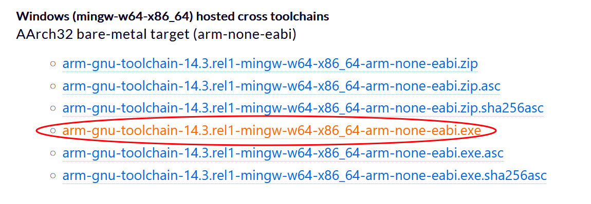
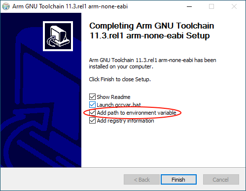
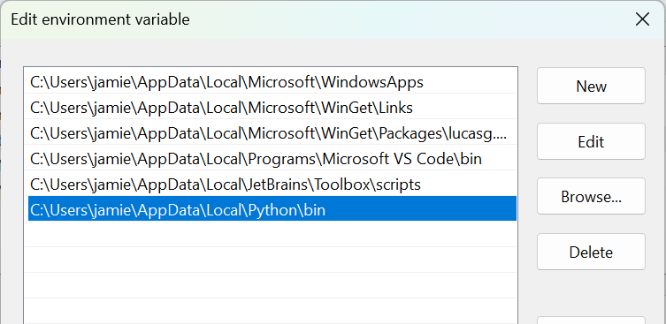

# Toolchain Installation

This page explains how to set up ARM GCC and other tools on your computer so that you can compile Mbed CE projects.

## Windows

Note: You can also watch this in video version - [Youtube guide](https://youtu.be/ubf6ODHOHEs)

1. Install CMake and Ninja. You can download these manually ([here](https://cmake.org/download/) for CMake and [here](https://github.com/ninja-build/ninja/releases) for Ninja), but the easiest way is to use WinGet. To install them with winget, open an administrator command prompt, then run
    ```
    > winget install Kitware.CMake Ninja-build.Ninja --scope machine
    ```

2. Go to ARM's [toolchain download page](https://developer.arm.com/downloads/-/arm-gnu-toolchain-downloads) and download the exe installer under "Windows (mingw-w64-x86_64) hosted cross toolchains" &gt; "AArch32 bare-metal target (arm-none-eabi)".  Then, execute it and go through the installer, making sure to check the "Add path to environment variable" box!

    

    

3. If you don't already have it, install [Git](https://git-scm.com/). It is important for work with Github repos - creating, importing or cloning of projects and libraries.

4. If you don't already have it, install Python 3 so that you can run python from the command line. The easiest way to do this is to use winget to install python install manager, via an administrator command prompt:
    ```
    > winget install --scope machine Python.PythonInstallManager
    ```
    Then, in a *newly opened, non-administrator* terminal, you can install Python and make the new version the default. Example for 3.13:
    ```
    > py install 3.13
    > setx PYTHON_MANAGER_DEFAULT 3.13
    ```
    
    **Important!** It is recommended not to install the latest Python release if it's less than a couple months old. This will help you to avoid potential incompatibility issues with some dependencies later, as not every Python package publishes binaries right away for new releases. As of this writing (Oct 2025), use of version 3.13 or older is recommended.

5. Add Python to your path. Search for "Edit environment variables for your account" in the start menu and click on the top result. Then find and edit "Path" in the top pane. Finally, add `C:\Users\<YourUsername>\AppData\Local\Python\bin` to the list of path entries. When done, it should look like: 

    

6. Reboot your machine so that the changes to your PATH are applied. Then the toolchain should be set up!

## On Mac:
1. If you don't already have Homebrew, install it according to its instructions [here](https://brew.sh/).
2. Install cmake and ninja with `brew install cmake ninja` in the terminal.
3. Add a Brew remote for the ARM toolchain: `brew tap osx-cross/arm`
4. Install the toolchain: `brew install arm-gcc-bin`
5. Lastly, make sure Pip is installed to your system python.  In a terminal, run `sudo -H python3 -m easy_install pip` 

The toolchain should now be set up!

## Linux:
_note: We do not recommend using the official Debian/Ubuntu `gcc-arm-none-eabi` package due to an as-yet-unfixed [bug](https://bugs.debian.org/cgi-bin/bugreport.cgi?bug=953844) that prevents proper compilation of Mbed OS.  As far as we can tell, the packages from ARM do not have this bug._

1. Install CMake >= 3.19. 
    - For recent distros, e.g. Ubuntu 22.04 and newer, you can just use the package manager CMake package.
    - For Ubuntu 16.04, 18.04, and 20.04, use [this APT repo](https://apt.kitware.com/).
    - Many distros can also utilize the [CMake snap package](https://snapcraft.io/cmake). 
    - Otherwise, if your distro doesn't have a version recent enough, you may have to build it from source.
2. Install [Ninja Build](https://ninja-build.org/).  On Ubuntu you can install it with `sudo apt-get install ninja-build`, though other distros may vary.
3. Go to ARM's [toolchain download page](https://developer.arm.com/downloads/-/arm-gnu-toolchain-downloads) and download the tar.xz toolchain under "x86_64 Linux hosted cross toolchains" &gt; "AArch32 bare-metal target (arm-none-eabi)".
    - Note: If using an ARM64 machine like a Raspberry Pi, get the "AArch64 Linux hosted" build instead.
4. Open a terminal in the folder where you downloaded the tar.xz file, and extract it with `tar xf arm-gnuXXXX.tar.xz` (replace "arm-gnuXXXX" with the full name of the toolchain file)
5. Using the terminal, copy the entire folder to /usr/local on your machine by running: `sudo mv arm-gnuXXXX /usr/local/gcc-arm`.
6. Add the toolchain to your PATH.  The recommended way to do this is by editing `/etc/environment` (e.g. `sudo nano /etc/environment`).  Add the path `/usr/local/gcc-arm/bin` at the end (adding a colon before to separate it from the other paths).  For example, on Ubuntu 22.04, my environment file looks like
    ```shell
    PATH="/usr/local/sbin:/usr/local/bin:/usr/sbin:/usr/bin:/sbin:/bin:/usr/games:/usr/local/games:/snap/bin/:/usr/local/gcc-arm/bin"
    ```
7. Save the file and exit by hitting Ctrl-O, then Enter, then Ctrl-X
8. Restart all terminal windows to pick up the new path.

The toolchain should now be set up!

# Extras: Installing Debuggers
If you want to debug your code, you will also need to install one of the upload methods that supports debugging.  Which one to use depends on your specific setup -- generally openocd and pyocd can be used on all processors, but others such as STM32Cube only work with specific ones.  See the [Upload Methods](../upload-methods.md) page for details about the methods and how to install them.

# Optional: Install CCache
CCache will speed up compilation a lot by caching built files and reusing them if the dependencies haven't changed. The current download can be found here: https://ccache.dev/
Windows: Unzip the downloaded files to a program directory. Add the path to the environment path variable (Win Key, type 'env' for quick access). Then CMake will find the CCache tool and add it to CMakeCache.txt.

