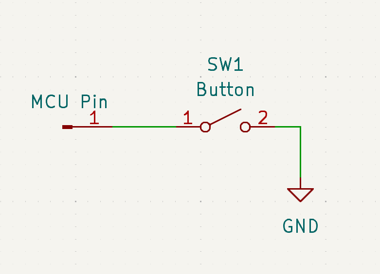

# I/O Pin Basics

Inputs and outputs, usually shortened to I/O, are the bread and butter of microcontroller functionality. Sure, you have your more complex busses and signals like I2C and PWM, but, at the end of the day, a lot of times you just need to read or write a signal on a pin.

This doc page will explain how to use the basic I/O functionality of Mbed, and cover important concepts about how pins are named and assigned.

Generally speaking, there are four kinds of I/O:

- Digital inputs
- Digital outputs
- Analog inputs (ADCs)
- Analog outputs (DACs)

Mbed has several different classes that allow access to these functions, and we'll go through them all in this how-to guide.

## Digital I/O
### Digital Outputs (`DigitalOut`)
If all you need to do is set a pin to high or low in code, then the [`DigitalOut` class](https://mbed-ce.github.io/mbed-os/classmbed_1_1_digital_out.html) is your friend. This class must be constructed with a pin name and, optionally, a default state for the pin. Once constructed, it will make the pin output the value.

```cpp
DigitalOut myOutputPin(PA_0); // Creates a digital out on PA_0 that defaults to low
DigitalOut myDefaultHighPin(PA_0, 1); // Creates another digital out that defaults to high
```

!!! note "Pin Names"
    The valid pin names that you can pass to Mbed objects like `DigitalOut` vary by MCU. The easiest way to find out the list of valid names is to look at the `PinNames.h` file for your target. You can find this file by navigating to the definition of the `PinName` enum via your IDE.

    Also, documentation for your target may provide a list of the valid pin names and what functions they offer.

    In this page we will be using STM32-style pin names (e.g. PA_0), but there are other styles in use by different targets.

`DigitalOut` provides the `write()` function which writes a value to a pin:

```cpp
myOutputPin.write(1); // Sets the pin high
```

Mbed also overloads `operator=` for DigitalOut, so you can simply set the pin equal to 0 or 1 to accomplish the same thing:

```cpp
myOutputPin.write(0); // Sets the pin low
```

If we wish to toggle the pin, there is also the `read()` function which returns the current state. Suppose we wanted to make a program that toggled the state of the board LED once a second. We could do that like:

```cpp
DigitalOut led1(LED1);
while(true) 
{
    led1 = !led1.read();
    ThisThread::sleep_for(1s);
}
```

!!! note "LED Pins"
    Most Mbed boards provide at least one LED, and #define `LED1` to be an alias for its pin name. However, not every board does this, so this code might need modifications depending on your setup. 

    Also note that the LED might be active high (turns on when the pin is high) or active low (turns on when the pin is low), so you will either need to consult your board schematic or do an experiment to determine this.

### Digital Inputs (`DigitalIn`)

What if you want to read the value of a pin, instead of writing it? That's where [DigitalIn](https://mbed-ce.github.io/mbed-os/classmbed_1_1_digital_in.html) comes in. This class, once instantiated, allows access to the value of a pin. 

```cpp
DigitalIn myInput(PA_1);
if(myInput.read()) {
    printf("Pin is high!\n");
}
else {
    printf("Pin is low!\n"); 
}
```

`DigitalIn` also implements a cast operator to integer, so it can be directly used in many contexts that expect an integer or boolean value, such as an if statement:

```cpp
if(myInput) {
    ...
}
```

#### Pullups/Pulldowns

Pullup and pulldown resistors are very useful to control the state of an input when nothing is directly driving it. For instance, suppose you connected an I/O pin of your Mbed board to a button, with the other side of the button connected to ground.

{: style="width: 50%"}

When the button is pressed, the MCU pin will be connected to ground. But what about when the button is NOT pressed? In this case, the MCU pin will be floating, and its state will not be super well defined. In a naive circuit, the pin will just pick up random noise from the circuit and the environment, and its state will constantly change. To prevent this, some MCUs implement a pulldown/pullup/keeper circuit on I/O pins by default, so you won't get the random noise, but the circuit may still not work as intended.

To fix this, we need to "pull up" the MCU pin to the I/O voltage with a resistor:

{: style="width: 50%"}

This ensures that if the button is not pressed, the pin will read a high value.

As this is a very common problem to run into, most MCU manufacturers include built-in pullup and pulldown resistors on each pin, so that you don't need a physical one on your board. 

In Mbed, these resistors can be enabled by passing a pin mode value to the second argument of the DigitalIn constructor, or by calling the `mode()` function after creating the pin.
 
```cpp
DigitalIn inputWithPullup(PA_2, PullUp);

DigitalIn inputWithPulldown(PA_3);
inputWithPulldown.mode(PullDown);
```

!!! warning "Resistance Values"
    The actual values of the pullup and pulldown resistors vary by target MCU, so consult your target documentation and the MCU datasheet for the actual values. In general, these resistors have very large tolerances, so they should not be used in situations where an exact resistance value is needed for the circuit to work.

### Bidirectional I/O (`DigitalInOut`)

I/O pins are fully capable of changing their direction at runtime, and can be switched from an input (potentially w/ a pullup) to an output at any time. This functionality can be accessed via the [DigitalInOut](https://mbed-ce.github.io/mbed-os/classmbed_1_1_digital_in_out.html) class.

This class provides access to the full GPIO API and allows controlling the full state of one GPIO pin. For example, suppose two digital pins are connected together with a wire. We can use `DigitalInOut` to send values back and forth:

```cpp
DigitalInOut inOut1(PA_1); // defaults to input with default pullup
DigitalInOut inOut2(PA_2, PIN_OUTPUT, PullDefault, 0); // Set as output low

inOut1.read(); // returns 0

inOut2 = 1;
wait_us(10); // Give it some time for the signal to propagate
inOut1.read(); // returns 1

// Switch directions of pins. Switch the output pin first so we don't have two output pins fighting with each other.
inOut2.input();
inOut1.output();
inOut1 = 1;

wait_us(10);
inOut2.read(); // returns 1
```

!!! warning "Digital Glitches"
    Currently Mbed does not provide a single function to change the direction of a pin and set its value in a glitch-free manner. So, for example, if changing a pin from an input to a logic high output, the pin may change from input to logic low output for a few microseconds, and then change to logic high.

    Fixing this issue is something we'd love to work on in the future.

#### Open-Drain Operation

As you may have realized, "normal" bidirectional pins aren't great for communicating information between multiple chips, because there needs to be some kind of prior agreement on who is driving the pin at any one time. Otherwise, you could cause a potentially damaging short by having one chip drive the pin high and another drive it low. 

Open-drain is a convention for I/O pins that solves this problem. When a pin is in open-drain mode, it has only two states. Writing a 1 to the pin sets it to high-impedance mode (potentially with a weak pullup), and writing a 0 to the pin writes a logic low to it. When the pin is read, it returns the electrical state rather than the configured state, so if you are writing a 1 but see the value as 0, then you know that somebody else is setting it to 0.

This convention (plus an external pullup resistor) nicely solves the problem of high versus low conflicts. If all connected chips are writing a 1, the signal stays as logic high. If one or more chip writes a 0, then the signal changes to logic low. And no matter what, you can never create a short no matter which devices are outputting high and low.

Here's an example of using DigitalInOut in open drain mode to communicate between two pins that are connected together:
```cpp
DigitalInOut pin1(PA_1, PIN_OUTPUT, OpenDrain, 1);
DigitalInOut pin2(PA_2, PIN_OUTPUT, OpenDrain, 1);

// With neither pin set low, we should see both pins reading high
pin1.read(); // returns 1
pin2.read(); // returns 1

// Outputting a low on one open drain pin should bring both pins low
pin1 = 0;
wait_us(10); // Give it some time for the signal to propagate
pin1.read(); // returns 0
pin2.read(); // returns 0
```

!!! warning "Open-Drain Pullup Resistors"
    On some targets, the OpenDrain pin mode automatically enables a pullup resistor. On other targets, you would need to connect an external pull-up resistor to run this example.

### Bus I/O

If you need to work with multiple I/O pins at once, Mbed provides the [BusIn](https://mbed-ce.github.io/mbed-os/classmbed_1_1_bus_in.html), [BusOut](https://mbed-ce.github.io/mbed-os/classmbed_1_1_bus_out.html), and [BusInOut](https://mbed-ce.github.io/mbed-os/classmbed_1_1_bus_in_out.html). These classes work nearly identically to `DigitalIn`, `DigitalOut`, and `DigitalInOut` except that they work with multiple pins at a time (up to 15).

Read and write operations return binary numbers, with bit 0 corresponding to the first pin passed in to the constructor, bit 1 corresponding to the second pin, etc.

```cpp
BusOut myBus(PA_0, PA_1, PB_0, PB_1)
myBus = 0b1010; // Writes a high to PB_1 and PA_1 and a low to PB_0 and PA_0
```

!!! note "Binary Literals"
    This example uses a relatively new feature of C++, which is the ability to write out binary numbers in code using the 0b prefix. `0b1010` is equivalent to 0xA or 10.

Bus I/O is useful for implementing parallel interfaces, where the bits of a number are transferred via a group of GPIO lines.

!!! warning "Limitations of Bus I/O"
    The Bus[In/Out] classes are not "true" multi-pin I/O -- they are implemented as pure wrappers around arrays of Digital[In/Out] classes. This is convenient because they can work with any pins, regardless of what I/O port the pins are on. However, this means that all the pins aren't written or read at the exact same time.

    This means that the Bus I/O classes are not currently suitable for implementing high speed parallel busses (~MHz clock rate). There are some options to fix this in Mbed, but for now if you need this capability you'll have to access the I/O registers directly.

### Interrupts

But what if you want to just get a notification only when a pin changes state, without having to constantly check it? Mbed offers the [`InterruptIn`](https://mbed-ce.github.io/mbed-os/classmbed_1_1_interrupt_in.html) class for this purpose. Just like a DigitalIn instance, an InterruptIn is constructed with a pin and optionally a PinMode, and can be used to read the pin's value. However, InterruptIn also provides the ability to set callbacks for when the pin rises and falls.

!!! note "Pin Support for Interrupts"
    For InterruptIn to work, the pin you pass needs to support interrupts. _Most_ pins of _most_ MCUs do support interrupts, but not _every_ pin of _every_ MCU. For instance, on LPC1768, the P1_xx pins do not support interrupts.

For example, suppose you wanted to count how many times a button is pressed. You could do that like this:
```cpp
#include <mbed.h>
#include <atomic>

std::atomic<unsigned int> pressedCount = 0;

void onRisingEdge() 
{
    ++pressedCount;
}

int main()
{
    // note: This assumes that the button needs a pullup -- some boards may need a pull down or something else!
    InterruptIn buttonIn(BUTTON1, PullUp);
    buttonIn.rise(onRisingEdge);

    while(true)
    {
        ThisThread::sleep_for(1s);
        printf("Press count: %u\n", pressedCount.load());
    }
}
```

In this example, we pass the `onRisingEdge` function as a callback to the interrupt in. It will then call this function each time the pin has a rising edge (a transition from low to high).

!!! note "Callbacks"
    To pass the function to the InterruptIn, Mbed uses a type called `mbed::Callback`. This is a function pointer type, and works a bit similarly to `std::function` (but suited for embedded usage). Callbacks can also be created from class member functions and lambdas.

    See [this page](../api-reference/platform/Callback.md) for more info on callbacks.

!!! warning "Debouncing"
    If using an InterruptIn to read a button in a real project, you will need some form of debouncing circuit between the button and the MCU. This is because mechanical buttons are very noisy and can generate multiple edges when pressed. If you don't filter these out, these edges could cause the interrupt to trigger constantly and monopolize your CPU!

