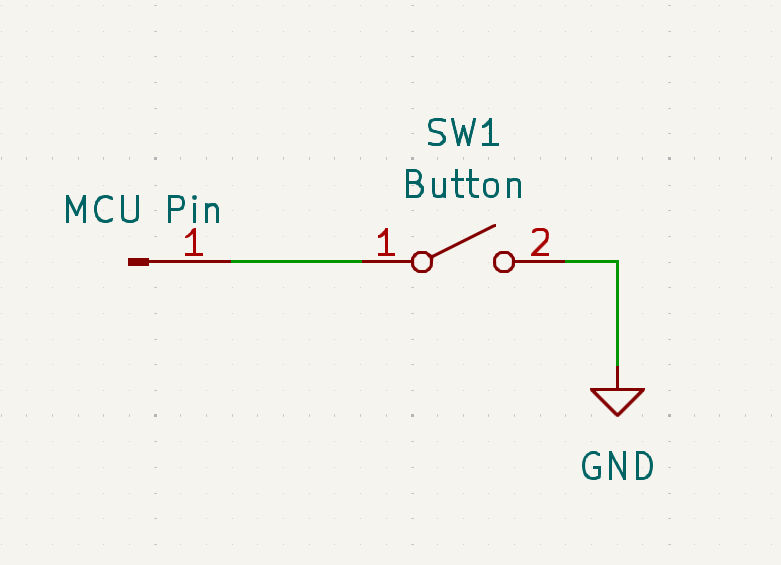
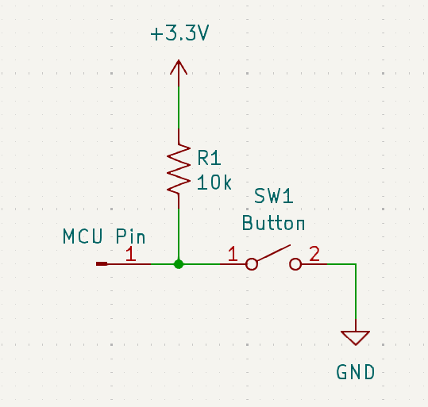

# I/O Pins

Inputs and outputs, usually shortened to I/O, are the bread and butter of microcontroller functionality. Sure, you have your more complex busses and signals like I2C and PWM, but, at the end of the day, a lot of times you just need to read or write a signal on a pin.

This doc page will explain how to use the basic I/O functionality of Mbed, and cover important concepts about how pins are named and assigned.

Generally speaking, there are four kinds of I/O:

- Digital inputs
- Digital outputs
- Analog inputs (ADCs)
- Analog outputs (DACs)

Mbed has several different classes that allow access to these functions, and we'll go through them all in this how-to guide.

## Digital I/O
### Digital Outputs (`DigitalOut`)
If all you need to do is set a pin to high or low in code, then the [`DigitalOut` class](https://mbed-ce.github.io/mbed-os/classmbed_1_1_digital_out.html) is your friend. This class must be constructed with a pin name and, optionally, a default state for the pin. Once constructed, it will make the pin output the value.

```cpp
DigitalOut myOutputPin(PA_0); // Creates a digital out on PA_0 that defaults to low
DigitalOut myDefaultHighPin(PA_0, 1); // Creates another digital out that defaults to high
```

!!! note "Pin Names"
    The valid pin names that you can pass to Mbed objects like `DigitalOut` vary by MCU. The easiest way to find out the list of valid names is to look at the `PinNames.h` file for your target. You can find this file by navigating to the definition of the `PinName` enum via your IDE.

    Also, documentation for your target may provide a list of the valid pin names and what functions they offer.

    In this page we will be using STM32-style pin names (e.g. PA_0), but there are other styles in use by different targets.

`DigitalOut` provides the `write()` function which writes a value to a pin:

```cpp
myOutputPin.write(1); // Sets the pin high
```

Mbed also overloads `operator=` for DigitalOut, so you can simply set the pin equal to 0 or 1 to accomplish the same thing:

```cpp
myOutputPin.write(0); // Sets the pin low
```

If we wish to toggle the pin, there is also the `read()` function which returns the current state. Suppose we wanted to make a program that toggled the state of the board LED once a second. We could do that like:

```cpp
DigitalOut led1(LED1);
while(true) 
{
    led1 = !led1.read();
    ThisThread::sleep_for(1s);
}
```

!!! note "LED Pins"
    Most Mbed boards provide at least one LED, and #define `LED1` to be an alias for its pin name. However, not every board does this, so this code might need modifications depending on your setup. 

    Also note that the LED might be active high (turns on when the pin is high) or active low (turns on when the pin is low), so you will either need to consult your board schematic or do an experiment to determine this.

### Digital Inputs (`DigitalIn`)

What if you want to read the value of a pin, instead of writing it? That's where [DigitalIn](https://mbed-ce.github.io/mbed-os/classmbed_1_1_digital_in.html) comes in. This class, once instantiated, allows access to the value of a pin. 

```cpp
DigitalIn myInput(PA_1);
if(myInput.read()) {
    printf("Pin is high!\n");
}
else {
    printf("Pin is low!\n"); 
}
```

`DigitalIn` also implements a cast operator to integer, so it can be directly used in many contexts that expect an integer or boolean value, such as an if statement:

```cpp
if(myInput) {
    ...
}
```

#### Pullups/Pulldowns

Pullup and pulldown resistors are very useful to control the state of an input when nothing is directly driving it. For instance, suppose you connected an I/O pin of your Mbed board to a button, with the other side of the button connected to ground.

{: style="width: 50%"}

When the button is pressed, the MCU pin will be connected to ground. But what about when the button is NOT pressed? In this case, the MCU pin will be floating, and its state will not be super well defined. In a naive circuit, the pin will just pick up random noise from the circuit and the environment, and its state will constantly change. To prevent this, some MCUs implement a pulldown/pullup/keeper circuit on I/O pins by default, so you won't get the random noise, but the circuit may still not work as intended.

To fix this, we need to "pull up" the MCU pin to the I/O voltage with a resistor:

{: style="width: 50%"}

This ensures that if the button is not pressed, the pin will read a high value.

As this is a very common problem to run into, most MCU manufacturers include built-in pullup and pulldown resistors on each pin, so that you don't need a physical one on your board. 

In Mbed, these resistors can be enabled by passing a pin mode value to the second argument of the DigitalIn constructor, or by calling the `mode()` function after creating the pin.
 
```cpp
DigitalIn inputWithPullup(PA_2, PullUp);

DigitalIn inputWithPulldown(PA_3);
inputWithPulldown.mode(PullDown);
```

!!! warning "Resistance Values"
    The actual values of the pullup and pulldown resistors vary by target MCU, so consult your target documentation and the MCU datasheet for the actual values. In general, these resistors have very large tolerances, so they should not be used in situations where an exact resistance value is needed for the circuit to work.

### Bidirectional I/O (`DigitalInOut`)
#### Open-Drain Operation
### Bus I/O
### Interrupts
## Analog Inputs
### ADC Basics
- ADC types
- Voltage references
- Accuracy/ENOB
- Conversion time
### Using `AnalogIn`
## Analog Outputs
### DAC Basics

!!! note "Don't confuse analog outputs with PWM!"
    It's common to confuse a "true" analog output (a DAC) with a PWM output. These are not the same thing! A true analog output outputs an actual analog voltage, while a PWM output outputs a square wave that averages out into an analog voltage. It is possible to approximage an analog voltage using a PWM output, but you would need an external filtering circuit, and this comes with other downsides (limited current sourcing capability, voltage ripple, etc). Meanwhile, an actual DAC just gives you an exact analog voltage, no muss, no fuss.

    And yet... the Arduino framework continues to mislead people about this to this day by referring to setting a PWM as an "[analog write](https://docs.arduino.cc/language-reference/en/functions/analog-io/analogWrite/)".

### Using `AnalogOut`
