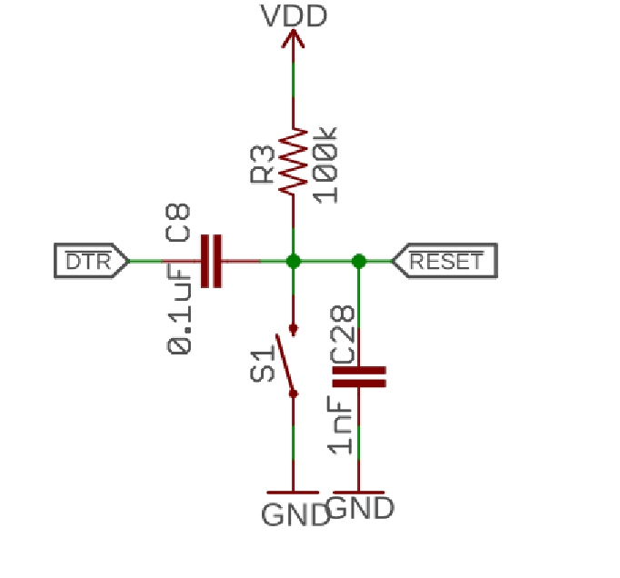

# AMA3B1KK (Ambiq Apollo3) MCU Overview

{: style="width: 50%"}

The AMA3B1KK (also known as the Ambiq Apollo3 Blue) is a capable MCU with integrated Bluetooth support. It is generally available to consumers as the [Artemis Module](https://www.sparkfun.com/sparkfun-artemis-module-low-power-machine-learning-ble-cortex-m4f.html) from SparkFun, which integrates an AMA3B1KK MCU, a Bluetooth antenna, and a 32MHz crystal.

| CPU | Flash/Code Memory | RAM | Communication Peripherals | Other Features |
|---|---|---|---|---|
| <ul><li>48-MHz Cortex M4F (hardware supports 96MHz boost, but this is not yet implemented)</li><li>Dedicated second BLE core with HCI interface (not user programmable)</li></ul> | 1 MiB Flash memory | 384 kiB SRAM | <ul><li>6x IOM (each can become an SPI or I2C instance)</li><li>2x UART</li><li>1x QSPI/OSPI (not currently supported by Mbed)</li></ol> | <ul><li>ADC with 10 muxed inputs, plus temperature sensor</li><li>28x PWM (see below)</li><li>RTC (not currently supported by Mbed)</li><li>Watchdog Timer (not currently supported by Mbed)</li><li>GPIO with interrupt capability</li></ol>|

## Programming and Debugging

### SVL Bootloader
All supported AMA3B1KK boards (except for `SFE_ARTEMIS_DK`) rely on the SparkFun Variable Loader (SVL) to upload code without a dedicated programmer/debugger. This is described in more detail on the [upload methods page](../upload-methods.md#ambiq-svl), and is easy to set up (it's bundled with Mbed!).

### Serial Port Reset Circuit

In order for SVL to work, there needs to be a way for the host machine to reset the MCU. This has been implemented by connecting the serial port DTR control line to the MCU reset line via a high-pass filter (see below).

{: style="width: 50%"}

When the serial port is opened, DTR goes low, and the MCU is pulled into reset. Then, R3 charges the reset line back up, and around 100us later, the AMA3B1KK is released from reset. 

In many ways, this is a clever idea, as it allows resetting the chip without involvement from SW on the chip (which might not be working), but also doesn't require the serial terminal to bring DTR high again to take the chip out of reset (I made that mistake once!).

However, this does have a side effect that users should watch out for. Opening a serial terminal to the board will **always reset the chip**, wiping away whatever it was previously doing!

### Boot Differences with the Bootloader
In my testing, I've observed that it takes around 300ms for the SVL bootloader to transfer control to the application after power is released. This is a long delay, and necessitated an adjustment to Mbed OS's CI test scripts to wait longer after opening the serial port before trying to talk to the chip. It appears that this delay is mostly due to a sleep inside the bootloader that waits for a host PC to try to talk to it before running the application.

Also, there appears to be a logic glitch that occurs when the chip boots which can often manifest as a junk byte (and therefore a unicode decode error) on the serial output. I do not know the cause of this, but it is mentioned in SparkFun's documentation, so it appears to be a known issue.

### Debugging

AMA3B1KK is supported by the J-Link and PyOCD debuggers. The former requires J-Link hardware, while the latter will work with any CMSIS-DAP device. Personally, I experienced silky smooth debugging by attaching a PicoProbe to the SWD pins on my RedBoard Artemis (by cutting the debug ribbon cable, stripping the wires, and feeding them through the fine pitch holes).

!!! warning
    Due to the serial port reset circuit described above, opening a serial terminal will reset the chip and likely crash your debug session. Always open your serial terminal *before* starting the debugger.

Also note that one board, the [Artemis Development Kit](https://www.sparkfun.com/sparkfun-artemis-development-kit.html), does have a built-in CMSIS-DAP debugger, so you can simply use PyOCD with it out of the box. I'd recommend getting this board if you plan to be debugging code!

## Clock Sources

The AMA3B1KK has a total of four clock sources: 

1. The High Frequency RC Oscillator (HFRC), which is an internal oscillator that creates 96MHz and 48MHz for the CPU and its peripherals
    - This has a base accuracy of +-3.5%, but can auto calibrate itself based on the XT crystal frequency.
    - I haven't been able to find an official spec for how much the calibration improves its accuracy, but in my testing it made it accurate to about +-0.1%
2. The 32MHz Crystal Oscillator (XO32M), which creates a high-accuracy 32MHz clock for the bluetooth radio. This crystal is contained inside the Artemis module and doesn't need to be added to the board.
3. The 32.768kHz Crystal Oscillator (XT), which creates a 32.768kHz clock for a number of sources inside the Apollo3, including the LP Ticker and the RTC. It's also used to calibrate the HFRC.
4. The Low Frequency RC Oscillator (LFRC), which is a 1024Hz +-32% internal oscillator. It can be used as a fallback if other clock sources are not present (and for creating very, very slow PWM signals).

Having only an RC oscillator (albeit one with a calibration feature) is unusual among ARM MCUs, and means that high speed clocks and counters driven by them (e.g. Mbed's μs ticker) will be relatively inaccurate. Luckily, more accuracy is present in the XT oscillator, which drives the Low Precision Ticker and the Real-Time Clock. Mbed also turns on the HFRC calibration feature, meaning that the XT frequency will be used to automatically tune the HFRC. This means that within a few seconds after boot, the HFRC frequency should become significantly more accurate.

Note that since the XT clock is used to calibrate the HFRC and drive certain timers, Mbed does not recommend omitting the XT crystal in designs with this chip.

## Other Notes

### Timer Usage by Mbed
Mbed OS manages the `STIMER` peripheral and uses it to implement the μs ticker. It is not recommended to use this peripheral in user code. Use Mbed OS Timers and Tickers instead.

Mbed OS uses both segments of `CTIMER_7` to implement the Low Precision Ticker. This means that this timer is not available for PWM or timing purposes.

### GPIO Naming
Unusually, the AMA3B1KK does not have its GPIOs organized into ports. It simply has 50 I/O pins, numbered from 0 to 49. Mbed refers to these as `IO_x`, e.g. `IO_0` and `IO_25`.

### PWM Assignment
We have lots of PWMs to work with here! The AMA3B1KK has 8 CTIMER modules, each of which has two independent segments that can each generate two PWM outputs (with the same frequency but different duty cycles). This gives 32 total outputs, and there are 32 pins that can be mapped to PWM, giving a 1:1 mapping.

However, both segments of CTIMER_7 are used by the LP ticker. This means that the chip effectively has 28 PWMs spread across the 32 pins, though each pair of two PWMs on the same segment must use the same frequency.

To see which pins are paired with each other, look [here](https://github.com/mbed-ce/mbed-os/blob/95138e4d6a756c72a87cc87a6a87cae4b40d47eb/targets/TARGET_Ambiq_Micro/TARGET_Apollo3/device/PeripheralPins.c#L275). For example, since IO_12 and IO_25 both use CTIMER_A0, they must have the same frequency set in order to work.

### Internal Temperature Sensor

The AMA3B1KK features an internal temperature sensor which is connected to one of the ADC inputs. You can read this temp sensor by constructing an `AnalogIn` with `INT_TEMP_SENSOR` as the pin name.

To convert the value from volts to degrees, however, you must use a function from the Ambiq SDK which reads the calibration constants burned into the chip at the factory. And this function has an... interesting... calling convention.

To get you started, here's an example (based on [here](https://github.com/sparkfun/Arduino_Apollo3/blob/74a4786eef78e0457548d43e23366a20dfa4410e/cores/arduino/sdk/core-implement/CommonAnalog.cpp#L55)):

```cpp
float getTempDegC() {
    static AnalogIn intTempSensor(INT_TEMP_SENSOR);
    float tempSensorVolts = intTempSensor.read_voltage();

    float fVT[3];
    fVT[0] = tempSensorVolts;
    fVT[1] = 0.0f;
    fVT[2] = -123.456;
    uint32_t ui32Retval = am_hal_adc_control(am_adc_handle, AM_HAL_ADC_REQ_TEMP_CELSIUS_GET, fVT);
    MBED_ASSERT(ui32Retval == AM_HAL_STATUS_SUCCESS);

    return fVT[1]; // Get the temperature
}
```

### Analog Reference Voltage

The AMA3B1KK has a several options for analog voltage references: an internal 1.5V +-1.7% reference, an internal 2.0V +-1.5% reference, and an external reference provided on the ADC_REF pin (which can be either 1.5V or 2V).

Currently, Mbed OS hardcodes usage of the 2V reference to provide the maximum possible analog range. This means that analog in pins can **only measure voltages between 0V and 2V**, not the full 3.3V I/O voltage range!

Also note that ADC_REF is not pinned out on the Artemis module, so it's impossible to use the external ADC reference with this hardware.

### GPIO Pullups and Pulldowns

Every GPIO pin other than IO_20 has an optional pullup resistor. This resistor has a real value between 13 and 27 kOhms. Note that some specific pins have four different pullup resistor options, but the other options are not currently supported by Mbed.

IO_20, on the other hand, has the option for a pulldown resistor and is the only IO that does. This resistor has a real value between 26 and 40 kOhms.