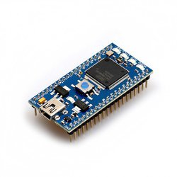

# LPC17xx MCU Overview



The LPC1768 was the very first MCU to receive support from Mbed back in 2009, and it's one of the only early MCUs that's still supported in the latest Mbed version.  While it might be getting a little long in the tooth, with fairly high power consumption and small RAM compared to its modern competitors, it's still a capable chip with a large array of peripherals.  Not to mention, it has a significant base of educational users who rely on the Mbed LPC1768 dev board for their courses and projects.  Here's hoping we can keep this venerable chip supported for a long time coming!

_Note: Confusingly, the Mbed LPC1768 dev board is also called the LPC1768.  This seems to be an early naming standard that was later dropped.  On this page I'll say "the dev board" when I specifically mean the Mbed LPC1768 PCB; otherwise I mean the microcontroller itself._ 

Mbed also supports the official NXP dev board for the LPC17xx series of micros, the [LPCXpresso LPC1769](https://www.nxp.com/part/OM13085) (OM13085UL), via the `LPCXPRESSO_LPC1769` Mbed target. This board is similar to the Mbed LPC1768 in terms of features (includes an Ethernet PHY and a debug interface onboard), and it even has a compatible pin layout. 

## Feature Overview
| CPU | Flash/Code Memory | RAM | Communication Peripherals | Other Features |
|---|---|---|---|---|
| Cortex-M3, up to 100MHz or 120MHz<br>(clocked at 96MHz on the Mbed dev board) | 512 kiB| **Total:** 32 kiB (SRAM) + 32 kiB (AHBSRAM)<br>_See note about memory banks below_ | <ul><li>3x I2C (2 pinned out on Mbed dev board)</li><li>4x UART (3 pinned out on Mbed dev board), one has hardware flow control</li><li>2x SPI</li><li>1x CAN</li><li>1x USB</li><li>1x Ethernet</li></ol> | <ul><li>1x DAC (AnalogOut)</li><li>1x ADC (AnalogIn), 200kHz, 8 multiplexed inputs</li><li>6x PWM outputs (all must share a common pulse period)</li><li>RTC</li><li>4x 32-bit hardware timers (one used by Mbed)</li><li>DMA (not supported by Mbed, but can be used through the [MODDMA](https://os.mbed.com/users/AjK/code/MODDMA/) library)</li></ol>|

#### A note about LPC1768 memory banks
The LPC1768 divides its RAM into two banks: main SRAM and AHBSRAM.  The AHBSRAM bank is optimized for use with DMA, but is also usable as standard RAM.  However, it is not contiguous with the first one, so the GNU linker is not able to automatically place global variables in it.  Thus, only the first 32k bank is available to naive code.

To make use of AHBSRAM, you need to manually place items in it using an attribute declaration.  If you have code like this:
```cpp
SomeLargeObject obj;
```
change it to:
```cpp
SomeLargeObject obj __attribute__((section("AHBSRAM")));
```
This will move the object into the ABHSRAM bank.  This can be used on both global variables and static variables inside functions. However, be aware that AHBSRAM is currently not zero initialized during init, so you might need to do some of your own memsetting of such objects.

In Mbed CE, heap allocations (unlike statically declared variables) will automatically use space from AHBSRAM.

Additionally, when Ethernet connectivity is used, Mbed automatically places the networking buffers into AHBSRAM1.

## Dev Board Firmware Update (PLEASE READ)
As of 2022, new LPC1768 Mbed dev boards are still being shipped with very old firmware on their interface chips.  Not only does this firmware not support debugging, it also **makes thread sleeps run for an incorrect amount of time!**  You will find that your MCU sleeps for 10ms when you tell it to sleep for 1ms!  No, I don't know _why_ this happens, but I do know how to fix it.

To update the firmware, simply download [this file](https://os.mbed.com/media/uploads/samux/mbedmicrontroller_141212.if) and save it onto the LPC1768 dev board's USB drive.  Then, unplug the USB connection to turn off the power and plug it back in again.  Leave the board alone for a few seconds, and it should flash the firmware and boot like normal.

More details on the interface firmware [here](https://os.mbed.com/handbook/Firmware-LPC1768-LPC11U24).

## Configuring Clocking
Mbed OS can accept several different clock frequencies on LPC17xx MCUs, if configured correctly. Specifically, for the PLL configuration to work out, the clock frequency in MHz must be an integer factor of 24. So, 24, 12, 8...1MHz are all OK, but 5MHz or 10MHz is not. If changing the clock frequency from the default of 12MHz, you must add an mbed_app.json5 option like so:
```json
"target.lpc17xx-xtal-freq": 24000000 // 24MHz
```

Electrically, to supply the clock on your PCB, you must either connect a crystal between XTAL1 and XTAL2, or connect an external 1.8V oscillator to XTAL1. Chapter 4 of the reference manual has lots more information on how to set this up correctly.

Additionally, a 32.768kHz crystal can be connected to the RTCX1 and RTCX2 pins to provide a clock source to the RTC.  However, this is optional, and the crystal is not even powered up until the RTC is used in code.

## Semihosting and the LocalFileSystem
Thanks to being the original Mbed design, the Mbed dev board has a unique feature that is no longer found on any other Mbed targets: the LocalFileSystem.  Most Mbed boards emulate a USB drive, allowing you to drag and drop bin files onto the board to program it. The LPC1768 dev board takes this a step further, and allows your code to actually read and write files on the very same virtual USB drive.

How does this work?  Well, it's a bit complicated.  Essentially, the interface chip (the second MCU on the bottom of the LPC1768 dev board) is always debugging the LPC1768, even when you do not have a debugger connected.  This interface chip is also connected to a 2MB flash that stores the virtual USB drive's data.  When you interact with the LocalFileSystem, code inside Mbed stores magic values in certain registers, then issues a "bkpt" instruction to manually trigger a debugger break.  The interface chip detects this breakpoint, carries out the requested operation (e.g. reading from a file), stores the data into the LPC1768's memory, and then unpauses the MCU.  This Rube Goldbergian mechanism (using debugger breakpoints to transfer data) is called semihosting, and can also be used to transfer text between a host PC and a microcontroller (replacing a UART terminal).  It was used on a lot of earlier ARM dev tools, but seems less common these days, perhaps because it has serious performance penalties.

However, there is a pretty major problem with LocalFileSystem as currently implemented: sleep mode.  When the LPC1768 goes to sleep, the mbed interface debugger gets [disconnected](https://github.com/mbed-ce/mbed-os/blob/f3866c0ff184a0452fb9af86b4707763cafa5f42/targets/TARGET_NXP/TARGET_LPC176X/sleep.c#L22), and the semihosting connection is broken.  This means that LocalFileSystem, and other semihosting features, will no longer be operational.

This is a serious issue because there are a lot of potential places the MCU can go to sleep.  If you are using mbed-baremetal, sleeps will only really happen when you call `ThisThread::sleep_for()` or one of the other sleep functions, so you just need to avoid those (wait_us() is safe).  But if you are using mbed-os, sleeps occur whenever the idle thread runs -- basically, whenever a blocking operation like a sleep or a wait for a mutex happens and there is no thread that's able to execute.  So, if you really want semihosting to work, you need to ensure that there is always at least one thread able to run at any given time in your application.  One workaround is to create your own idle thread with a higher priority than the Mbed idle thread which does not sleep:

```cpp
[[noreturn]] void sleeplessIdleFunc()
{
	while(true) {}
}
Thread sleeplessIdleThread(osPriorityLow, OS_STACK_SIZE, nullptr, "Sleepless Idle Thread");

void main()
{
    sleeplessIdleThread.start(&sleeplessIdleFunc);
    ...
}
```

Despite these issues, LocalFileSystem might still be useful if you just want to make a simple application which saves data onto the dev board memory, with minimal code and no external storage.  For an example of how to use this API, see the [Mbed CE LocalFileSystem example](https://github.com/mbed-ce/mbed-localfilesystem-example)!

## Other Notes
### TIM3 Usage
One of the 32-bit timers, TIM3, is used to implement the Mbed us_ticker.  The other three timers, TIM0 through TIM2, are available for application usage.

### Debugging the LPC1768 Dev Board
This dev board is a bit harder to debug than most Mbed targets.  First of all, the debugging interface didn't exist until the latest interface chip firmware revision.  So, make sure to do the "Dev Board Firmware Update" section first.  Additionally, while pyOCD used to work with this device, a change in version 0.11 [broke something](https://github.com/pyocd/pyOCD/issues/745), so only 0.10 and older work (and those versions only run on Python 2.7, blech!).  So, as of 2022, the only supported debugger option is OpenOCD (with some workarounds implemented by Mbed CE).  If you install OpenOCD and use `-DUPLOAD_METHOD=OPENOCD`, you should be able to flash and debug the LPC1768 just fine.

**Note:** As of Jan 2025, OpenOCD 0.11 and 0.12 can successfully debug this board, but latest Git OpenOCD cannot debug it due to a newly added "quirks mode" option. Support for this will be added once OpenOCD 1.0 is released.

### Interrupts
The LPC1768 can make use of interrupts (InterruptIn) on any of the port 0 or port 2 I/O pins (on the Mbed dev board, that's every pin except p19 and p20).  However, each port shares a single interrupt for all its pins, so performance might not be great if you have a lot of different interrupts firing on different pins, since the interrupt handler has to read the interrupt registers to figure out which pin(s) triggered the interrupt.

There are also four external interrupt (EINT0-3) pins which have dedicated interrupts, but these are not supported natively by Mbed.  Note also that the EINT3 interrupt number is shared with regular GPIO interrupts, so only EINT0-2 are usable as truly dedicated interrupts.

### Deep Sleep
The current Mbed OS implementation for this MCU does not support deep sleep, due to an LPC1768 issue which prevents the MCU from waking up if a debugger is connected when it enters deep sleep.

See [AN10915](http://web.archive.org/web/20130515133045/http://www.po-star.com/public/uploads/20120319123122_141.pdf) section 4.4.6 for details.

### Disabling Semihosting on Custom Boards
If you make a custom board with the LPC1768 MCU, and you compile your code for the `LPC1768` Mbed target, you will probably get random-seeming crashes.  The reason for this is, operations like sleeping attempt to interact with the Semihosting API, which tries to communicate with the Mbed interface chip using BKPT instructions (see above).  If this chip is not present, bad things happen.

To fix this problem, create a custom target (e.g. `STANDALONE_LPC1768`) with a custom_targets.json file like this:
```json
{
  "STANDALONE_LPC1768": {
    "inherits": ["LPC1768"],
    "device_has_remove": ["LOCALFILESYSTEM", "SEMIHOST"]
  }
}
```

This turns off the semihosting features, allowing code to run without an interface chip present.  Needless to say, the semihosting and LocalFileSystem APIs will be unavailable.

### Using Ethernet with the Dev Board
The LPC1768 dev board (and the LPCXpresso board) include an integrated Ethernet PHY, but need external magnetics and an ethernet jack in order to actually communicate over the network.  One easy way to do this is using a [SparkFun MagJack breakout](https://www.sparkfun.com/products/13021), hooked up per the diagram [here](https://learn.sparkfun.com/tutorials/mbed-starter-kit-experiment-guide/experiment-5-internet-clock).

### LPC17xx MCU Line Porting Notes
Currently, Mbed only has targets for the "top of the line" MCUs, which are the LPC1768 and 1769. However, there is a [whole family](https://www.nxp.com/docs/en/brochure/75016846.pdf) of LPC17xx chips, and you can get a cheaper and/or smaller chip if you don't need all the features of these top-of-the-line chips.

To the best of my knowledge, Mbed should mostly "just work" on these chips so long as user code does not actually use the features that don't exist. For example, if the chip only has 2 I2Cs, trying to use the third I2C would likely result in a crash, but if you avoid using it, you should be good. Or, on chips with less than 512 k of flash, you should be good as long as your program size doesn't exceed the actual amount of flash on the chip (and you don't use FlashIAP to write to nonexistent areas of flash).

One exception, however, is that some chips, such as the LPC1764, have less than the normal 64k of SRAM. This presents an issue for the normal Mbed memory configuration, which uses all 64k as heap space and uses space from the second RAM bank for Ethernet buffers. If you really want to use one of the chips with 32k (or less) of RAM, a custom target and modifications to the Mbed linker script would be needed, and Ethernet is likely impossible.

### CPU Clock Configuration
Most LPC17xx MCUs support a maximum CPU clock of 100MHz. However, Mbed OS clocks these MCUs at 96MHz because it's difficult to support USB otherwise (as the PLL0 clock needs to be a factor of 48MHz).

The LPC17x9 MCUs, however, support a higher clock rate of 120MHz. You can enable this higher clock speed with the following mbed_app.json option:

```json
"target.lpc17xx-core-clk-120mhz": true
```

This option is used by default on the `LPCXPRESSO_LPC1769` board. In my testing, it can also be used as an overclock for the standard chips, if you are feeling up to it!

## Datasheets
- [Mbed LPC1768 dev board schematic](http://mbed.org/media/uploads/chris/mbed-005.1.pdf) (note, this is an HTTP download, so you may have to copy the URL to a new tab to get it to download)
- [Electrical Datasheet](https://www.nxp.com/docs/en/data-sheet/LPC1769_68_67_66_65_64_63.pdf)
- [Programmer's Reference Manual](https://www.nxp.com/webapp/Download?colCode=UM10360) (behind registration wall, but free)
- [Errata](https://www.nxp.com/docs/en/errata/ES_LPC176X.pdf)