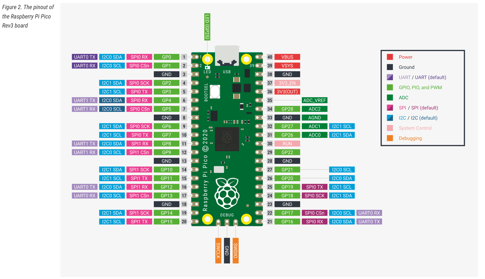
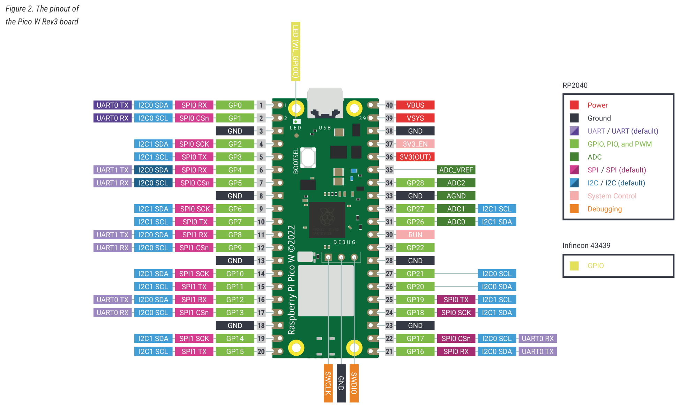
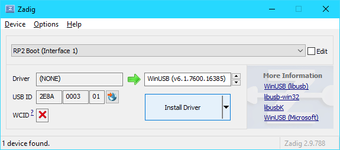
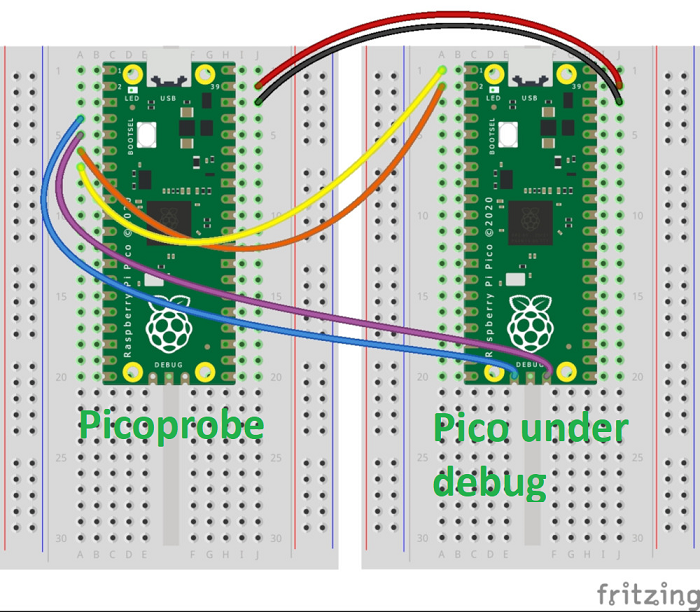

# RP2040 MCU Overview
| CPU | Flash/Code Memory | RAM | Communication Peripherals | Other Features |
|---|---|---|---|---|
| 125 MHz dual Cortex-M0+. Note that only core 0 is currently supported by Mbed (see below). | 2 MB Flash memory<br> (ext. on-board chip)| 264 KB SRAM <br> (in six contiguous banks)| <ul><li>2x I2C</li><li>2x USART/UART</li><li>2x SPI</li><li>1x USB</li></ol> | <ul><li>ADC 3x 12bit (AnalogIn)</li><li>16x PWM</li><li>RTC</li><li>GPIO with external interrupt capability</li></ol>|

## Datasheets
- Datasheet and Reference Manual: [RP2040](https://datasheets.raspberrypi.com/rp2040/rp2040-datasheet.pdf)
- For more manuals or notes [visit raspberrypi.com page](https://www.raspberrypi.com/products/raspberry-pi-pico/)

## Boards based on this MCU:
* [Raspberry Pi Pico and Pico W](https://www.raspberrypi.com/products/raspberry-pi-pico/)
* [SparkFun Thing Plus - RP2040](https://www.sparkfun.com/products/17745)

### Raspberry Pi Pico Board


The RPi Pico board is the standard dev board for the RP2040.

[Datasheet](https://datasheets.raspberrypi.com/pico/pico-datasheet.pdf)

### Raspberry Pi Pico W Board


The RPi Pico W extends the base Pico board with a Cypress (Infineon) CYW43493KUBG wi-fi module. The board should work just like a regular Pico, except that GPIO23 through GPIO25, plus GPIO29, are connected to the wifi module and not available. However, currently Mbed supports neither the SDIO hardware interface nor this model of Wi-Fi module, so if you wish to use the Mbed network stack, I would recommend against using this board.

[Datasheet](https://datasheets.raspberrypi.com/picow/pico-w-datasheet.pdf)

### SparkFun Thing Plus RP2040
{: style="width: 50%"}

The SparkFun Thing Plus RP2040 extends the standard RP2040 board with some additional circuitry, including a battery charger and battery fuel gauge. It also provides an 8x larger flash chip.

It also has a reset button, which lets you reboot to bootloader mode without replugging the USB connector, which might help save wear and tear on your board. However, the SWDIO and SWCLK pads are much harder to access on this board, so connecting a debugger is more difficult.

[Schematic](https://cdn.sparkfun.com/assets/5/4/f/6/b/RP2040_Thing_Plus_Schematic.pdf)

## Getting started with Raspberry Pi Pico under Mbed CE
If you're using a Raspberry Pi Pico with Mbed, you have two options for how to program it. 

### Programming with the Bootloader
The first option is to load files to the board directly using its bootloader. This requires no extra hardware, but requires a manual procedure (hold down BOOT or BOOTSEL, then plug in the USB) each time you wish to program the board. 

Before the bootloader can be used, the `picotool` loader program must be installed. On Windows, you may download a binary for the tool [here](https://sourceforge.net/projects/rpi-pico-utils/files/v1.3.0/picotool.exe/download) and copy it into any location on your PATH. For other platforms, install instructions can be found on the [picotool repository](https://github.com/raspberrypi/picotool).

Now, put your Pico into bootloader mode using the procedure above and run `picotool info` in a terminal window. You should see your device show up! This indicates it's ready to be programmed by Mbed. Use "RASPBERRY_PI_PICO" for MBED_TARGET, which tells Mbed to use the USB port as a serial port by default.

You should now be able to load code, such as the hello world program, and see your program's output on the board's USB serial port!

**For Windows only:** If your device is not showing up, you might need to manually load the WinUSB driver for it. This can be done using [Zadig](https://zadig.akeo.ie/).



### Programming with an SWD Debugger

If you plan to use your Pico for more advanced development, it might be worthwhile to hook up an SWD debugger. This allows you to program it automatically instead of going through the dance above. Mbed supports any debugger which exposes the CMSIS-DAP interface, including the highly affordable [Raspberry Pi Picoprobe](https://github.com/mbed-ce/mbed-os/wiki/MCU-Info-Page:-RP2040#raspberry-pi-picoprobe) and the [Makerdiary Pitaya-Link](https://makerdiary.com/products/pitaya-link). To hook up the probe, you must:
- Connect the probe ground to your target ground
- Connect the SWDIO and SWCLK signals between the probe and the target
- Connect the probe's UART signals (TX and RX) to the target. (Careful! On the Pitaya-Link, the signal labeled "TX" is actually the receive line and should be connected to your board's TX pin).

Use "RASPBERRY_PI_PICO_SWD" for MBED_TARGET, which activates SWD debug support and activates the serial console on the TX and RX pins. It is recommended to use "OPENOCD" for your UPLOAD_METHOD, though PYOCD may also work. Once Mbed CE is configured and your probe is hooked up, you should be able to flash code using Mbed CE like normal!

#### Raspberry Pi Picoprobe
There are two options here, buy one or make one. It is possible to buy an official [Raspberry Pi Picoprobe](https://www.raspberrypi.com/products/debug-probe/) but for price of 2-3 Picos.
If you are a maker...

* buy one more [Pico](https://www.raspberrypi.com/documentation/microcontrollers/raspberry-pi-pico.html)
* [download picoprobe binary](https://github.com/raspberrypi/picoprobe/releases)(uf2) and upload it according to first part of [Programming with the Bootloader](https://github.com/mbed-ce/mbed-os/wiki/MCU-Info-Page:-RP2040#programming-with-the-bootloader). It is same firmware like for official Picoprobe.
* prepare wires according to picture below
* a case is optional but you can make one soft with a heat shrink or make one with [3D printer](https://www.thingiverse.com/search?q=picoprobe&page=1&type=things&sort=relevant)



## Other Board Info

### PWM Pin Assignment
The RP2040 supports PWM on all 30 I/O pins, using a fixed muxing architecture:


Basically, there are 8 independent PWM generators, and each GPIO is mapped to either the A or the B output of one of these generators. The A and B outputs must share the same period, but can have independent pulse widths (duty cycles).

Be careful: two pins which are connected to the same output of the same PWM generator can't be both used for PWM at the same time. For example, I could use GPIOs 0 and 17 for PWM at the same time, because one uses generator 0 channel A and the other uses generator 0 channel B. However, I couldn't use GPIOs 0 and 16 for PWM at the same time, because those both use generator 0 channel A.

### USB Serial
Since the RP2040 boards lack a separate USB-serial converter chip, by default, Mbed OS uses the USB port as a USB-serial adapter so that you can view what your code is printing. Unfortunately, this prevents the USB port from being used for anything else. To change this behavior, drop the following lines in your mbed_app.json's target_overrides section:

```json
"target.console-usb": false,
"target.console-uart": true
```

This will redirect the debug console to the TX and RX pins instead (pins 0 and 1), freeing up the USB port for your application to use. Of course, you'll need to connect an external 3.3V USB-serial adapter to those pins if you want to view your debug console...

Note: If you use the RASPBERRY_PI_PICO_SWD configuration, the above configuration change is applied automatically.

### RTC Limitations
On this processor, the RTC cannot keep time through a reset. It will revert back to being uninitialized, and you must write a new time to it before you can use it.

### Core Clock
Mbed requires a 12MHz crystal oscillator to be present on the XOUT and XIN pins. Or, alternately, a 12MHz logic level square wave may be fed into the XIN pin from an external clock source.

### Timer Usage
The RP2040 features a single internal TIMER module with 4 alarm outputs which can trigger interrupts. Mbed uses ALARM0 to implement the us ticker, and currently also may write to and change the TIMER's time value under certain circumstances. So, it is recommended not to use the TIMER or its alarms in user code. Use Mbed Timers and Tickers instead.

### Multicore Support
Currently, Mbed is only able to execute on core 0 of the MCU -- the second core is not started so the RP2040 essentially works as a singlecore device. This is due to Mbed's underlying RTOS, Keil RTX, lacking support for multicore processors. Ultimately, most applications will likely be OK using one core, but the second core is certainly be useful for applications where you need multiple things to happen at once or where you need both time-critical I/O and a general purpose program to execute simultaneously.

With the current architecture of Mbed, it would be possible to use the RP2040 in a "split" configuration, where each of the two cores has its own Mbed OS application to execute and its own RAM region to use. This is less memory efficient than having both cores execute the same program image (like how a multi-core desktop works), but since the RP2040 has a lot of RAM it should be feasible. Doing this would require linker script additions, build system changes, and some sort of inter-core communication API to be created. PRs are welcome!

Note that it should be possible to make use of the second core if you use the RP2040 SDK functions to launch your core 1 program, and then are careful to never interact with Mbed APIs or any peripherals used by the core 0 program on core 1. This is limited, but means that core 1 can be used for dedicated processing tasks.
