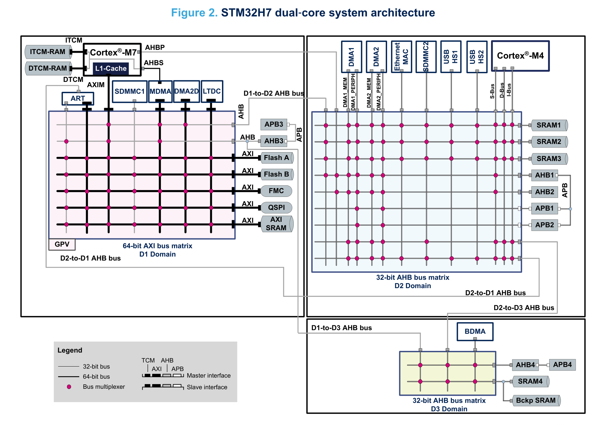

# STM32H7 Family of MCUs
Since its launch in 2017, the STM32H7 family has risen to an impressive level of popularity. As these chips boast high clock rates and powerful peripherals, yet are still reasonably simple to integrate into a PCB design, there's a lot to love on these chips!  Mbed OS currently supports a number of STM32H7 MCUs, and this page will provide comparisons of each and some background information.

## MCU Sub-Families
The STM32H7 MCUs can be divided into four distinct sub-families. Each sub-family has generally the same configuration, the only differences within a sub-family are the presence or absence of certain peripherals (e.g. cryptography and display controllers), the package, and the amount of flash memory.

|Sub-Family|MCUs Supported by Mbed|Auxilliary M4 Core| TCM RAM* | Other RAM| Core Clock (Overdrive**/Standard) | AHB Clock (Overdrive**/Standard) |
|-----------|----------------------|------------------|--------|----------|----------------------------------|--------------------------------|
| STM32H72x Family|STM32H723xG STM32H725xE STM32H735xG||**64kiB** ITCM (+192kiB that can be remapped from SRAM_D1), **128kiB** DTCM|**320kiB** SRAM_D1 **32kiB** SRAM_D2 **16kiB** SRAM_D3 **4kiB** Backup SRAM| 550MHz/400MHz | 275MHz/200MHz |
| STM32H743 Family| STM32H743xI STM32H753xI STM32H750xB|| **64kiB** ITCM, **128kiB** DTCM | **512kiB** SRAM_D1 **288kiB** SRAM_D2 **64kiB** SRAM_D3 **4kiB** Backup SRAM | 480MHz/400MHz | 240MHz/200MHz |
| STM32H745/47 Family | STM32H745xI STM32H747xI | Yes |**64kiB** ITCM, **128kiB** DTCM|**512kiB** SRAM_D1 **288kiB** SRAM_D2 **64kiB** SRAM_D3 **4kiB** Backup SRAM|480MHz/400MHz| 240MHz/200MHz|
| STM32H7Ax Family | STM32H7A3xI STM32H7B3xI ||**64kiB** ITCM, **128kiB** DTCM|**1MiB** AXI SRAM, **128kiB** AHB SRAM **32kiB** SRD SRAM **4kiB** Backup SRAM|280MHz/200MHz                   | 280MHz/200MHz                  |

*TCM (Tightly Coupled Memory) RAM is memory that runs at the same speed as the core and will be faster than other RAM for code and data access. As the TCM is relatively small, Mbed doesn't make much use of it by default, but advanced users can speed up their programs by relocating commonly used data and code into TCM.

**Overdrive (also known as VOS0) is an overclock mode that increases CPU speed but does not work over the full temperature range, does not work with some power configurations, and is not recommended for safety related applications.

## Specific MCUs
Note that flash memory amounts vary by part number so I'll also list them below. Also note that lots more part numbers exist for each of these MCU families, it's just that these are the only ones explicitly supported by Mbed at present.

|MCU|Sub-Family|Mbed Target(s) Using This MCU|Onboard Flash Memory|
|---|----------|-----------------------------|-----|
|STM32H723xG|STM32H72x Family|NUCLEO_H723ZG|1MiB|
|STM32H725xE|STM32H72x Family|WIO_H725AE|512kiB|
|STM32H735xG|STM32H72x Family||1MiB|
|STM32H743xI|STM32H743 Family|NUCLEO_H743ZI2|2MiB in two banks|
|STM32H753xI|STM32H743 Family||2MiB in two banks|
|STM32H750xB|STM32H743 Family||128kiB|
|STM32H745xI|STM32H745/47 Family|NUCLEO_H745ZI_Q_CM7, NUCLEO_H745ZI_Q_CM4|2MiB in two banks|
|STM32H747xI|STM32H745/47 Family|DISCO_H747I_CM7, DISCO_H747I_CM4, ARDUINO_PORTENTA_H7_M7, ARDUINO_PORTENTA_H7_M4, ARDUINO_GIGA_CM7, ARDUINO_GIGA_CM4|2MiB in two banks|
|STM32H7A3xI|STM32H7Ax Family|NUCLEO_H7A3ZI_Q|2MiB in two banks|
|STM32H7B3xI|STM32H7Ax Family||2MiB in two banks|

## Multiple Domains and Cores


STM32H7 MCUs are comprised of multiple "domains", where each domain contains a block of peripherals and bus masters connected by a bus matrix. (a "bus master" refers to any element in the MCU that can read/write data to peripherals and memory, such as CPU cores and DMA controllers). Each domain features its own independent reset and clock controls, and can be stopped or powered down to save energy. This allows the MCU core to, for example, power itself down until an interrupt arrives from a low-power peripheral. In most STM32H7 MCUs, the domains are:

- D1 domain: contains the Cortex-M7 core, the main SRAM, and the code flash.
- D2 domain: contains most peripherals , the D2 SRAM, and the Cortex-M4 coprocessor, if it exists
- D3 domain: contains certain low-power peripherals, a basic DMA controller, and a small D3 SRAM

!!! note
    In STM32H7Ax Family MCUs, the D1 and D2 domains are combined into one "CD domain", and the D3 domain has been renamed the "SRD" (Smart Run Domain).

Why does this domain stuff actually matter?  Obviously, one reason is low power applications: if you can set up your MCU to be woken up by one of the peripherals in D3 domain, you can power down the rest of the core and save energy. Another reason is that it determines access speed to different locations inside the MCU. For instance, memory access inside the D1 domain is 64 bit, while the D2 and D3 domains are 32-bit. This means that, theoretically, access by the M7 core to the D1 SRAM will be twice as fast as access to the D2 SRAM (though there are a lot of factors that could affect this in real operation!).

However, maybe the biggest reason to care about this is that the D3 domain is highly limited: its DMA controller does not have master access to the other domains, meaning that it can only copy data between D3 peripherals and the D3 SRAM -- NOT the main SRAM. This means that you must watch out when designing systems and circuit boards: peripherals on the AHB4 and APB4 busses are virtually impossible to use with DMA in a way that fits with the rest of Mbed's operation. Refer to Figure 1 in the datasheet (not the reference manual!) to find out which peripherals are on these busses on your MCU -- for instance, on the STM32H743, this affects I2C4, SPI6, LPUART1, and ADC3.

For more detailed information on the domain system, refer to [the AN5557 app note](https://www.st.com/resource/en/application_note/an5557-stm32h745755-and-stm32h747757-lines-dualcore-architecture-stmicroelectronics.pdf).

### Cortex-M4 Coprocessor
The STM32H745/47 family of MCUs contain two cores: a primary Cortex-M7 core and a secondary Cortex-M4 core. Though there are multiple ways to configure this, Mbed generally has the Cortex-M7 and M4 cores run from the first and second banks of flash, respectively. Since each flash bank can be loaded independently, building and flashing code for a dual core MCU is basically like building and flashing code for two different MCUs, except that they are inside the same chip. Each MCU uses its own section of flash and its own RAM banks, so they are almost totally independent from one another.

As far as I'm aware, communication between the cores is... something that Mbed has not really hashed out yet.

### Multiple DMAs
STM32H7 chips actually have *four* different DMA controllers:

- The general purpose DMA controllers (DMA1 and DMA2). These are used for basic transfers (copy x amount of bytes between memory and a peripheral) and more advanced looping/double buffered transfers
- The Master DMA (MDMA). This DMA is designed for copying data around within the D1 domain and for copying data produced by a DMA1/DMA2 request into the D1 domain. Of note is that this is the *only* DMA that has access to the ITCM and DTCM memory -- other DMAs cannot access it at all. It's also used for a few peripherals, such as the QSPI controller.
- DMA2D, which is a graphics specific DMA designed for copying and manipulating bitmaps
- Basic DMA (BDMA). This DMA is pretty similar to DMA1 and DMA2 (I did not spot any major differences in my cursory read through) except that it lives in the D3 domain and can only access peripherals and memory in that domain.

## Clocking
STM32H7 chips feature an internal oscillator accurate to approx. +-1%, as well as connections for an external high speed oscillator (HSE) and a low speed 32.768kHz oscillator (LSE). The LSE is used for some functionality like the low power ticker and the LPUART, but you can also disable the LSE and use the internal 32kHz oscillator instead.

If you make a custom board with the STM32H7 and wish to change around the clocking, you could create an [alias-only custom target](https://github.com/mbed-ce/mbed-ce-custom-targets) with a JSON file like:
```js
  "MY_CUSTOM_TARGET ": {
    "inherits": ["NUCLEO_H743ZI2"],
    "overrides": {
      "clock_source": "USE_PLL_HSE_EXTC", // USE_PLL_HSE_EXTC = external CMOS oscillator, USE_PLL_HSE_XTAL = external crystal, USE_PLL_HSI = internal 64MHz oscillator
      "hse_value": "25000000", // Frequency in Hz of the external crystal / oscillator
      "lse_available": true, // Change to false if you do not have an LSE

      // Optional, increase LSE drive strength if your LSE crystal is not starting reliably.
      // See mbed-os/targets/TARGET_STM/README.md for details
      // "lse_drive_load_level": "RCC_LSEDRIVE_HIGH"
    }
  }
```

Note that Mbed CE has refactored the clock configuration for STM32H7 MCUs (and we hope to do this for other STMicro MCUs as well). You can now use *any HSE crystal frequency between 2 and 50MHz*, so long as the frequency is divisible by either 2MHz or 5MHz. Modifying Mbed source files is no longer required to change the HSE frequency!

## Other Info
### Comparison vs MIMXRT Family
The STM32H7 can be seen as a direct competitor to NXP's MIMXRT family of devices (e.g. the [MIMXRT105x](https://github.com/mbed-ce/mbed-os/wiki/MCU-Info-Page:-MIMXRT105x-and-106x)). Both MCUs hit some of the highest clock rates available in Cortex-M microprocessors, and both are to some extent the flagship line from their respective companies. Having used MCUs from both families quite a bit, I'd say that I'm in a good position to compare them.

I would say that the strengths of STM32H7 are **circuit simplicity**, **documentation**, and **features**. Designing a circuit for an STM32H7 micro is fairly straightforward: you just feed in a clock signal and add capacitors to the pins that the datasheet tells you to. MIMXRTs, in contrast, have a mandatory switching regulator that has to be routed and require an external flash chip (+ the correct software configs for it). And STMicro documentation, while not *perfect*, at least makes an effort to tell you what things do and how to configure them. MIMXRT docs, however, are decidedly mediocre, and are full of confusing, badly formatted diagrams and weirdly worded explanations. Last but not least, STM32H7 MCUs have a wide breadth of features available, such as an arbitrary polynomial CRC accelerator, a DAC, and a JPEG codec. While MIMXRT MCUs have all the standard features one would expect for a microcontroller, they don't really have fun extras like these.

Another thing to note is that STM32H7x devices have much faster flash read speed than the MIMXRT line. STM32H7 can read 64 bits from flash at 70MHz, while (assuming you use an OSPI flash) MIMXRTs can read 8 bits at 133MHz. This means MIMXRTs are a lot more reliant on instruction caching and storing functions in ITCM in order to hit their max speed without being limited by the speed that the core can load instructions from flash.

Meanwhile, the MIMXRT family has its own strengths: **speed** and **MCU simplicity**. MIMXRTs can reach a faster core speed than STM32H7s, so they will be the winners in workloads that are very heavily CPU bound. And their bus speeds go higher as well on some models, so even for memory-bound workloads, they will likely take the upper hand. Also, there is a fundamental simplicity of design that one can appreciate about MIMXRT chips, even if it's a bit abstract. For instance,  almost all MIMXRTs have a single unified address space*, where all the DMA and MCUs can access all the peripherals. Meanwhile, STM32H7 has a highly complex address map where peripherals in each domain can only access specific other domains and peripherals. Sometimes that isolation might be useful, but it causes a lot of programming complexity. Another example is, MIMXRT MCUs have an elegant, unified crossbar (XBAR) interconnect that goes between virtually every peripheral. Though it's not perfect, it lets you build all sorts of interesting digital logic contraptions using the fabric of the MCU itself.

*MIMXRT117x and some of its relatives have an errata that interferes with this

So all in all, it's hard to really pick one or the other as better or worse; they are just good at different things. If you can handle the circuit complexity and documentation, and speed matters to you, I would recommend not discounting the MIMXRT as a possible competitor for the STM32H7!